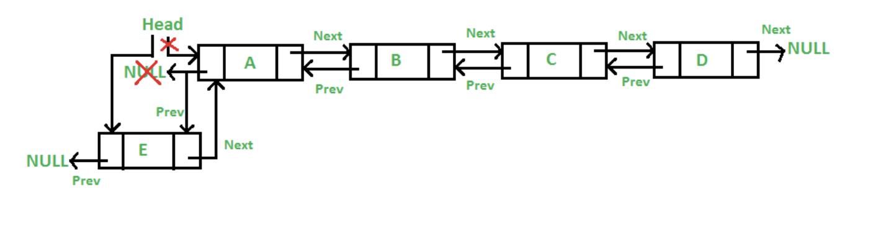
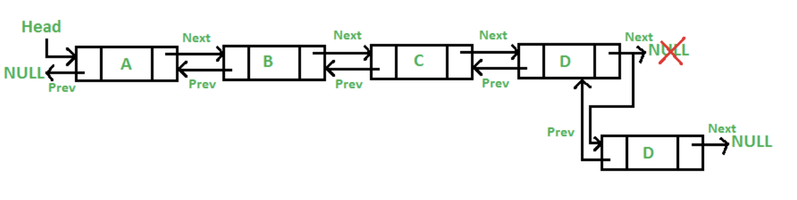
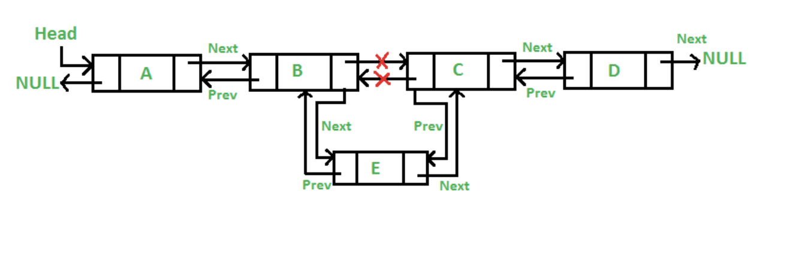

# Doubly Linked List *(DLL)*

In Lab2 you implemented what is callled a [singly linked list](https://www.geeksforgeeks.org/linked-list-set-1-introduction/).
The code for our node struct looked like this:

```cpp
typedef struct node{
	int myData;
	struct node* next;
}node_t;
```

Similarly our [stack](https://en.wikipedia.org/wiki/Stack_(abstract_data_type)) (Assignment 2, Part 2)
looked like this:

```cpp
typedef struct stack{
	int count;		
	unsigned int capacity;	// Stores the maximum size of our stack
	node_t* head;		// head points to a node on the top of our stack.
}stack_t;
```

In this assignment we are going to build on these ideas to create what is called a [doubly linked list](https://en.wikipedia.org/wiki/Doubly_linked_list) or a *DLL*

By adding a *previous* field to our node our list would like like this:


Thus a node will know who comes before and after it with the addition of a new pointer 'prev'.

# Our new DLL struct

Remember that our stack linked the nodes for us when we enqueued an element? The stack did this by using a variable *head* which stores 
the position of where the next element needs to go. In our new *DLL* struct besides having a *head* pointer we are also going to add a 
*tail* pointer. *head* will point to the start of the *DLL* and the *tail* will point to the end of the *DLL*. 
This will enable us efficient adding and removing at both ends of the *DLL*.

```cpp
typedef struct DLL{
	int count;		
	node_t* head;		// head points to the first node in our DLL.
	node_t* tail;		// head points to the last node in our DLL.
}dll_t;
```

# Implementing a Doubly Linked List (Your TO DO )

Implement the functions provided to you in the *my_dll.h* file. Do not modify the signatures ( names and arguments ) of these functions just provide the implementation (i.e. body of code).  

## Drawing a picture can help.

Note that drawing a picture of what needs to happen for each operation will help. For example:

* push_front



* push_back



* insert(int index, int data)



### Unit Tests

A unit test is a standalone test that checks for the correctness of a specific use case in your code. In our case, we are testing if we have a working *DLL* implementation. 

Please write unit tests to test your implementation. Some example tests we might come up with include:

* Fill a *DLL*, empty the *DLL*, and fill the *DLL* again.
* Test each function in your *DLL* when the *DLL* is not empty.
* Test each function in your *DLL* when the *DLL* is empty.
* etc.

- There is an example test file [dll_test.c](./dll_test.c) that you can add unit tests to or practice using to see if your implementation is correct.
	- Compile with: `gcc -g -Wall dll_test.c -o dll_test`
	- Run with: `./dll_test`
- You may otherwise modify [main.c](./main.c) with your own unit tests.

# Resources to help

- This is a nice interactive tutorial for learning C
  - http://www.learn-c.org/
- Doubly Linked List Data Type High level description
  - https://en.wikipedia.org/wiki/Doubly_linked_list (abstract_data_type)
  
# Feedback Loop

(An optional task that will reinforce your learning throughout the semester)

- Investigate/Review more data strutures on this webpage: https://visualgo.net/en/list
  - There are visuals for the doubly-linked list here!
  - Use them as a *rough* outline for the general concept. Do make sure to follow the specifications above.

