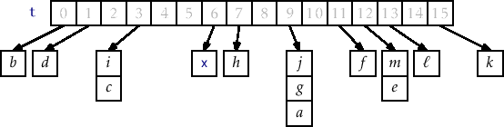
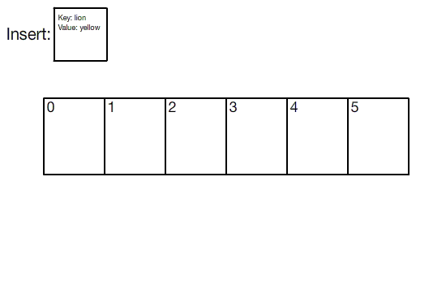

# Building Data Structures - Hashmaps

For this assignment, you are going to implement in the 'C' programming language the hashmap data structure. You will be filling out the functions in [./my_hashmap.h](./my_hashmap.h) to complete the hashmap implementation. Functions have been marked TODO.

**There is further support code** in the [./support](./support) directory with a partial implementation of the hashmap with a video tutorial.

## Hashmaps at a high level



Hash maps go by several other names, such as hash table and dictionary. All of the data structures however are similar (though language libraries may have slightly different gaureentees for each of the data structures). For this assignment however, we are going to implement a chained hash table. That is, you will have several buckets (i.e. arrays indices) for which you can search (i.e. through linked lists).

## Hashmap data structure power

Hash maps as we have learned as a data structure give us on average constant time, insert, update, remove, and find operations. This is incredibly powerful, and gives us yet another data structure in our toolbox to take advantage of. Hashmaps have additional flexibility over a data structure like an array, in that we can use any data type (even custom data types) as a key. For this assignment, we are going to use C-style strings as both are keys and values.

```c
// A key value pair
// This is specifically for a (char*, char*) key value pai
typedef struct pair{
    char* key;
    char* value;
}pair_t;
```

### Hash map in picture form

View below an animation of how items are added and linked together in the hash map.



#### Our implementation

Because we are implementing our hash map as a 'chained' implementation, this means we will have an 'array Of Lists' in our implementation. This means we are allocating an array of pointers (i.e. An array of linked lists).

```c
// Chained implementation of a hashmap
typedef struct hashmap{
    unsigned int buckets;   // i.e. size of the hashmap
    node_t** arrayOfLists;  // An array of linked lists for our buckets
                            // Read another way
                            //      - an array of node_t*

    // A function pointer to a hash function
    // The hash_function must take in a 'char*' as a key, and have a
    // second parameter specifying the number of buckets.
    hash_function hashFunction;
}hashmap_t;
```

Note that each of our linked lists in the `arrayOfLists` will point to a node that holds a key/value pair.

```c
// Each node holds a key and a value
typedef struct node{
    struct node* next;
    pair_t* kv;          // 'kv' stands for key/value pair
}node_t;
```

## Designing the algorithms

Each function in this assignment has notes on design in the .h file for implementing the hash map. What may make this assignment particularly difficult is working with 'strings' in C, so I have provided a few notes as well as a sample of what your insert *may* look like.

```c
void hashmap_insert(hashmap_t* _hashmap,char* key,char* value){
    if(hashmap_hasKey(_hashmap,key)== ??){
        return;
    }
    // Create a new pair_t
    // This means we are dynamically allocating some memory using
    // malloc for a new 'pair_t'
    pair_t* newpair = (pair_t*)malloc(sizeof(pair_t));
    // A pair_t consists of a key and a value, so we also need
    // to allocate memory for the 'key' and the 'value'
    // The amount of memory that we are allocating for is based on
    // the string length of the 'key' and 'value' that were passed in
    // from the function.
    newpair->key    = (char*)malloc(strlen(key)     * sizeof(char)+1); // Adding +1 for the null terminator
    newpair->value  = (char*)malloc(strlen(value)   * sizeof(char)+1); // Adding +1 for the null terminator
    // Now that we have allocated memory for our pair_t(named 'newpair)
    // we can copy in the data from our arguments(key and value)
    // using the strcpy function.
    // Copy the string passed by the user to our node using strcpy
    strcpy(newpair->key     ,key); 
    strcpy(newpair->value   ,value); 
    // Now we are ready to create a new node.
    // Remember that our nodes consist of 'key' and 'value' pairs
    // as the data, or in otherwords, a pair_t.
    //
    // Create a new node
    node_t* newnode = (node_t*)malloc(sizeof(node_t));
    newnode->next = NULL;
    newnode->kv = newpair;

    // The final step is to now figure out which bucket to add
    // our new node_t to.
    // We can figure out the bucket using the 'hash' function, because
    // remember, that is the job of a hash function.
    unsigned int bucket = _hashmap->???; // Call some function here
    // Once we have the appropriate bucket, we are in the correct 'index' into our array.
    // And remember, our array is an array of node_t, so we have to now iterate to
    // the end of the array and attach our node.
    // Create an iterator that points to the head of list for appropriate bucket
    node_t* iter = _hashmap->arrayOfLists[??];
    //
    // ... Insert node to appropriate linked list
    return;
}
```

### Notes on string operations

- [strcmp](https://www.tutorialspoint.com/c_standard_library/c_function_strcmp)
    - Useful for determinining if two `char*` are equal.
    - An example of how you may use it: 
        - `if(strcmp(iter->kv->key,key)==0)` This is testing if an iterates key/value ('kv') key is equivalent to the one being passed in the function. For example, The hashmap_hasKey function may benefit from this.
- [strcpy](https://www.tutorialspoint.com/c_standard_library/c_function_strcpy)
    - Useful for copying strings passed in as parameters.
    - See the above insert example.

## Compiling and running the program.

When you have made an attempt at hashmap, go ahead and try to run it. Remember to save, compile, and test early and often!

* Compile the source code with: `clang main.c -o main`
* Run the source code with: `./main`

# Unit Tests

A unit test is a standalone test that checks for the correctness of a specific use case in your code. In our case, we are testing if we have a working queue implementation. A sample unit tests is given:

```c
// Tests creation and deletion of the hashmap
// Ideally does not cause any segfaults, and this
// is considered passing.
int unitTest1(int status){
    int passed = 0;
    hashmap_t* test = hashmap_create(12);    
    hashmap_delete(test);
    passed = 1;
    return passed;
}
```

You *may* also consider writing some unit tests to test your implementation (In fact, I would strongly encourage you to do so). Note that you can include your unit tests in your submission, and we will have our own test suite. Some example tests we might come up with include:

* Fill a hashmap, delete the hashmap, and then recreate it again filling it with new values.
* Create an empty hashmap and attempt to add many things to it.
* Create an empty hashmap and add many duplicate keys to it.
* etc.

## Provided Tests

You are provided a file called queue_test.c which you can compile separately and test your implementation of your queue functions from your header file. Doing so does not guareentee a perfect assignment, but it will give you some confidence your implementation is working.

* Compile: `gcc hashmap_test.c -o hashmap_test`
* Run: `./hashmap_test`

# More resources to help

- [Open Data Structures Book on Hashing with Chaining](https://opendatastructures.org/ods-cpp/5_1_Hashing_with_Chaining.html)
- [Hashmap notes](https://www.inf.ed.ac.uk/teaching/courses/inf2b/algnotes/note04.pdf)

# (Optional) Going Further Task:

(This is an ungraded task--only work on this if you finish the deliverable). You will have to do a little bit of work to figure out how to open and read from files for this task.

- Try implementing additional helper functions for printing all of the values.
