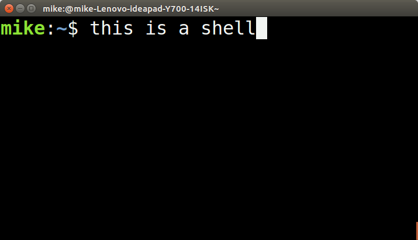
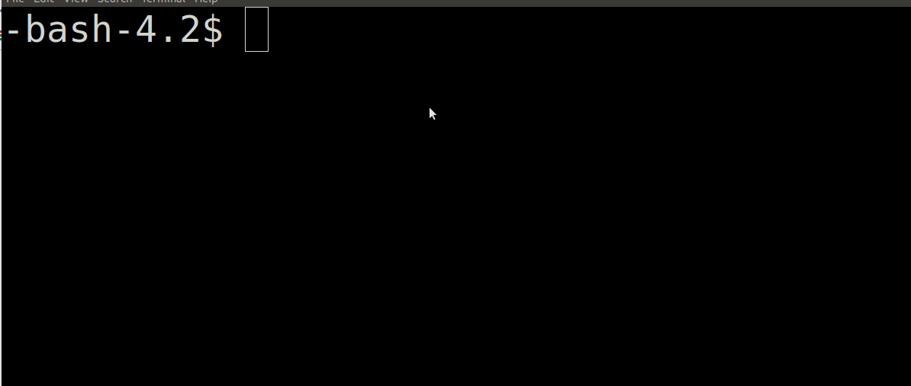

# README Please :)

**I strongly strongly strongly strongly recommend** you do all of your testing on your own [linux virtual box you have previously setup](https://www.google.com/search?rlz=1C1CHBF_enUS798US798&ei=t7GTXMb3JIOZ_QbEwZeYAg&q=setting+up+a+linux+virtualbox&oq=setting+up+a+linux+virtualbox&gs_l=psy-ab.3...7203.8384..8512...0.0..0.96.592.8......0....1..gws-wiz.......0i71j35i304i39j0i7i30j0i8i7i30j0i13i30j33i10.wdadpiXRdZ8). The reason why is because you will be using the fork() system call, which if called in an infinite loop can accidently create infinite copies of a process, thus taking all of the servers resources. Executing a shell that forks indefinitely (i.e. a [fork bomb](https://en.wikipedia.org/wiki/Fork_bomb)) **slows down the servers for everyone** (and may prevent you from logging in). We will be very reluctant to grant individual extensions because you blocked yourself and your classmates out from a shared resource. So by running your code on a virtual machine, if you do accidently create a fork bomb, you can simply restart your virtual machine.

So for this assignment, we recommend doing a 'git clone' of your repository in your virtual box, and working local to your machine while you test your code(remember you can still git add/commit/push from another location that you have cloned your repo). Only once you are very confident that your solution works, should you then test it on the Khoury servers. This may sound scary, but for the most part, folks have followed this direction and not caused any problems--just work locally first as you get setup.

# README Again

**I strongly strongly strongly strongly recommend** you do all of your testing on your own [linux virtual box you have previously setup](https://www.google.com/search?rlz=1C1CHBF_enUS798US798&ei=t7GTXMb3JIOZ_QbEwZeYAg&q=setting+up+a+linux+virtualbox&oq=setting+up+a+linux+virtualbox&gs_l=psy-ab.3...7203.8384..8512...0.0..0.96.592.8......0....1..gws-wiz.......0i71j35i304i39j0i7i30j0i8i7i30j0i13i30j33i10.wdadpiXRdZ8). The reason why is because you will be using the fork() system call, which if called in an infinite loop can accidently create infinite copies of a process, thus taking all of the servers resources. Executing a shell that forks indefinitely (i.e. a [fork bomb](https://en.wikipedia.org/wiki/Fork_bomb)) **slows down the servers for everyone** (and may prevent you from logging in). We will be very reluctant to grant individual extensions because you blocked yourself and your classmates out from a shared resource. So by running your code on a virtual machine, if you do accidently create a fork bomb, you can simply restart your virtual machine.

So for this assignment, we recommend doing a 'git clone' of your repository in your virtual box, and working local to your machine while you test your code(remember you can still git add/commit/push from another location that you have cloned your repo). Only once you are very confident that your solution works, should you then test it on the Khoury servers. This may sound scary, but for the most part, folks have followed this direction and not caused any problems--just work locally first as you get setup.

# Introduction

For this assignment, you will be writing your very own shell-- the mini-shell!



[Shell's](https://en.wikipedia.org/wiki/Shell_(computing)) (or sometimes called command-line interfaces) are text based applications that serve as an intermediate between the user and the operating system. The shell is also a tool for how a user interacts with the operating system. Previously, we have written many scripts that our shell can execute by running various programs. The shell that you build with this assignment will be something you can continually expand on in the future, and perhaps distribute as your own one day! Let us take a closer look at the tasks to get started.
 
# Task 1 - Signals

In your shell, you will have to implement a signal handler. We have very briefly discussed signal handlers, so make sure you are familiar with the concept. 

As a refresher, a [signal handler](http://www.gnu.org/software/libc/manual/html_node/Signal-Handling.html) is a software interupt that is sent to a process. Provided below is an example of sending a software interrupt to a process running a shell when you press 'Ctrl+C'. Signal handlers are handy for communicating with the operating system how to handle a process that may be misbehaving, or perhaps to [handle some other event](http://www.gnu.org/software/libc/manual/html_node/Kinds-of-Signals.html#Kinds-of-Signals).

```c
#include <stdio.h>
#include <stdlib.h>
#include <signal.h> // This is new!


// Create a signal handler
void sigint_handler(int sig){
	// Ask yourself why is 35 the last parameter here?
	write(1,"Terminating through signal handler\n",35); 
	exit(0);
}

int main(){

	// Install our signal handler
	signal(SIGINT, sigint_handler);

	printf("You can only terminate by pressing Ctrl+C\n");

	while(1){
		printf("Running forever!\n");
		sleep(1);
	}

	return 0;
}
```

* The following page provides details about signals: https://ftp.gnu.org/old-gnu/Manuals/glibc-2.2.3/html_chapter/libc_24.html
* The following article provides a nice introduction as well: https://www.thegeekstuff.com/2012/03/catch-signals-sample-c-code/

# Task 2 - Mini-Shell



You are now ready to create Mini-Shell. Mini-Shell is inspired by other popular shells. The good news is you can validate the behavior of your shell against the Unix terminal to ensure it is working.

At a high level, implementing mini-shell takes the following components:
1. You will have a function that reads in commands a user types.
2. Your program will execute in an infinite loop.
3. Your program will execute child processes from the shell (the shell is the parent process) based on the command.

## The specifications for your shell

1. You should have a prompt "mini-shell>" in front of each command that is typed out.
	- (If you want to be creative you can include the machine name or other information you can derive).
2. The maximum input size(i.e. BUFFER SIZE) on a given line will be 80 characters for our shell. You can specify this as a constant global variable.
3. Implement a signal handler so when the user presses <kbd>Ctrl+C</kbd> the text 'mini-shell terminated' is printed out.
	- Make sure that all child processes are terminated when this occurs!
4. When you launch a new child process from your shell, the child process should run in the foreground by default until it is completed.
	- Here are some examples: https://www.tutorialspoint.com/unix/unix-processes.htm
5. If the user adds the pipe '|' then the output of one process should be the input to the next process.
	- You can assume only one '|' will be used at most. e.g. `ls -l | wc`
	- As a hint, it can be helpful to have a separate function or use case that handles parsing a series of commands if a pipe is found when parsing the individual tokens.
	- Here are some examples: https://www.tutorialspoint.com/unix/unix-pipes-filters.htm
	- - You may not use the 'system' command which makes handling pipes trivial. You must investigate [dup](https://linux.die.net/man/2/dup) and file descriptors.
6. Your shell should have some built-in functions that you will have to implement (i.e. functions written in C code). These include 'exit' to terminate your shell, 'cd' so you may change directories, and 'help' explaining all the built-in commands available in your shell.
	1. You can test `cd` by moving up or down the directory tree.
		- (Hint the C library has commands for this)
	2. `help` should print out all of the built-in commands that you provide (including your user made one).
	3. `exit` should terminate the shell 
		- Note: If you launch another shell from within your shell, exit should only close out of the most recently launched shell.
7. You will want to think about how to store these built-in commands.
	- I will hint that using an array with commands and an array of function pointers is one possibly effective solution.
	- What is a function pointer? https://www.geeksforgeeks.org/function-pointer-in-c/
	- You can further think about what an array of function pointers looks like and why this may be appropriate.
8. If a command is not found, your shell should print out an error message, and resume execution.
	- e.g. `mini-shell>Command not found--Did you mean something else?`
9. You need to implement and document 1 addditional built-in command that you choose here. 
	1. This built-in command can be of your choosing, but should not be trivial (i.e. not just print a message or clear the screen).
		- An example might be 'history' which stores all of the previous commands a user has typed in and prints them out.
		- Another example may be 'guessinggame' which plays a little game in the terminal for guessing random numbers.
		- Another example may be when the user presses 'tab' a list of programs that can run are found.
		- You can be creative here. The constraint is that you are implementing this functionality in C, and not calling a script.
	2. (Edit the readme below with your built-in command)

-----------------------------------------------------
NAME: 

Nianlong Lin

SYNOPSIS: 

I create a new mini-shell.c file to my program.
here is the short description of my mini-shell program.
this program offers basic command execution and a few built-in commands.
commands can be piped together using the "|" symbol.
this shell handles SIGINT (ctrl + c) gracefully, ensuring the user gets feedback when attempting to exit.
Built-in commands:
1. exit: exits the mini-shell.
2. cd: changes the current directory.
3. help: displays the list of built-in commands.
4. guessing_game: a simple example


DESCRIPTION:

"guessing_game" is an engaging built-in command of this mini-shell, where users are prompted to guess a number between 1 and 5. the game provides immediate feedback on each guess and runs for a maximum of three guesses. if the user fails to guess correctly within the three attempts, the game reveals the correct number. futhermore, it provides a summary of the time taken by the user to play the game, allowing them to measure their response times in subsequent plays.

The game initializes by using the system's current time as a seed to the random number generator. This ensures that the generated number, between 1 and 5, is relatively unpredictable across different runs. User input is collected through standard input and compared with the generated number. Feedback is provided after each guess. The game also employs the system's time library to calculate the time taken by the user to complete their guesses. After either correctly guessing the number or exhausting all attempts, the total time taken is displayed.

-----------------------------------------------------

## Some helpful things to ponder

1. You are running programs in your shell. The programs that are being run are found in the 'bin' directory. For example, you would find a program called 'cat' or 'ls' there, which someone wrote in C for you.
2. You can also execute programs from a relative or absolute filepath (e.g. ./minishell)
3. There is not a program called 'cd' in the 'bin' directory, which means it must be built into the actual shell.
4. There exists more than 1 [exec](https://linux.die.net/man/3/exec) command -- some are helpful for finding things on your [environment path](https://en.wikipedia.org/wiki/PATH_(variable)). Hmm!

Provided below is an example for program that forks a new process, executes the process, and then resumes execution in the parent.

```c
#include <stdio.h>
#include <stdlib.h>
#include <sys/types.h>
#include <unistd.h>
#include <sys/wait.h>

int main(){

	char* myargv[16];
	myargv[0]="/bin/ls"; // Try changing this to "ls" Will the program work?
			     // Note: There are many versions of exec that will look in
			     //	      environment variable paths. See execvpe for example.
	myargv[1]="-F";
	myargv[2]=NULL; // Terminate the argument list
	
	if(fork()==0){
		// Executes command from child then terminates our process
		execve(myargv[0],myargv,NULL);
		printf("Child: Should never get here\n");
		exit(1);
	}else {
		wait(NULL); // This call makes the parent wait on its children.
	}

	printf("Finally, print from the parent\n");
	
	return 0;
}
```

## How do I test mini-shell?

The good news is you can validate the behavior of your shell against the Unix terminal to ensure it is working. Some samples you can reasonably test when getting started are the following:

```bash
./mini-shell
cat shell.c
nl shell.c
ls -l
pwd
cd .
pwd
nl shell.c | wc -l
cat shell.c | head 2
./mini-shell # Running a mini-shell within a mini-shell and then executing commands
cd ..
```

# Resources to help

- (See links above)
- And otherwise think about commands like fork, execvp, wait, waitpid, getpid, etc. :)

### Glossary and Tips
1. Commit your code changes to the repository often, this is best practice.
2. Do not commit your .o file or your executable file to the repository, this is considered bad practice!
3. On Functionality/Style
	1. You should have comments in your code to explain what is going on, and use good style (80 characters per line maximum for example, functions that are less than 50 lines, well named variables, well named functions etc.).
4. You may use any stdio.h functions that are useful, such as getline. You are welcome to implement these functions from scratch if you like however.
	1. You will want to include 'signal.h' as well for your signal handlers.
5. Careful when parsing. Things like newline characters '\n' like to sneak in and may make it difficult for strcmp to provide accurate results. "teststring" != "teststring\n"	

# Going Further

You might consider some of the following optional features in your shell.
1. Switching processes between forground and background (fg and bg commands).
2. Handling the '|', pipe  between an arbitrary number of processes.
3. Handle tab completion or moving through the history of commands with arrowkeys (This is a good example of a built-in command).

# Feedback Loop

(An optional task that will reinforce your learning throughout the semester)

Implementing a shell is one of the more fun exercises in learning C programming (in my opinion). However, it is quite relevant, especially in the context of the web browser and other applications (video games for example, often have a real-time shell interface for debugging).

Choose one of the following 3 papers to skim, and you can add notes here with two interesting things you discovered (Note this is not graded and completely optional).

- Grocoli: https://dl.acm.org/citation.cfm?id=2442019
- Integrating Command Shell in Web Browser: https://www.usenix.org/techsessionssummary/integrating-command-shell-web-browser
- Inky: http://people.csail.mit.edu/emax/papers/uist08-inky/uist08-inky.pdf

# F.A.Q.

- Q: Do I have to implement every shell command?
- A: No--that would be completely unreasonable! Think about how the 'exec' family of commands work and PATH. You are only implementing a few built-in commands that will execute. If a command is not a built-in command, then you attempt to execute linux programs found on PATH.
