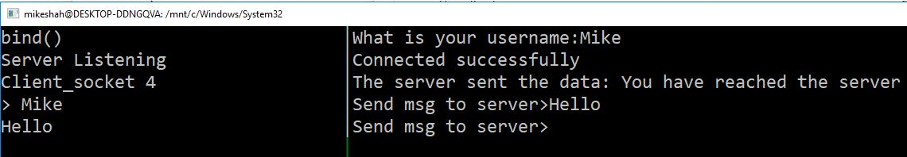
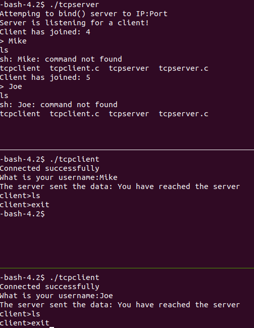

TODO Please edit the following information in your assignment

- Name: Nianlong Lin
- How many hours did it take you to complete this assignment? 3 hours
- Did you collaborate with any other students/TAs/Professors? No
- Did you use any external resources? (Cite them below)
  - tbd
  - tbd
- (Optional) What was your favorite part of the assignment?
- (Optional) How would you improve the assignment?

# Logistics

For this assignment, you must login into the servers. `your_khoury_name@login.khoury.neu.edu` to complete the assignment. The reason is because the examples I will provide below are compiled strictly for our machines architecture, and this is where I will test your code.

# Strategy

For this assignment, when you ssh in, it is helpful to use a tool like tmux to run the tcpserver in one window, and then run the tcpclient in another window. A screenshot is shown below.



# Introduction

For this assignment, you are going to be programming a chat server. You will be using the [sockets](http://man7.org/linux/man-pages/man2/socket.2.html) programming interface to build your client and server. Sockets are a standard way to handle communications between processes--in our case a server and multiple client processes.

# Part 1 - TCP Server

For the first part of this assignment, you will be implementing a TCP Server in tcpserver.c. [TCP](https://linux.die.net/man/7/tcp) is an internet protocol that ensures reliable transmission of data between a client and a server. The servers job is to wait passively for tcp clients to connect to it. In general a TCP server goes through the following steps:

1. Creation with a socket()
2. bind() the server to an addrses
3. listen() for client connections
4. accept() client connections
5. terminate()

## Your Task:

For the tcpserver, you must implement the following features:

1. Be able to accept any number of client connections--however, only one client will be able to interact with the server at a given time.
    - i.e. There is only a 1:1 connection.
2. When client that connects to the server should be sent the message "You have reached the server"
3. When a client joins the server, the server prompt should print the socket descriptor that has joined.
    - e.g. "Client has joined: 5" (i.e. you are printing the socket descriptor out)
4. The server should print out all messages it receives from each of the clients.
5. The server will execute each message that it receives from a client.
    - i.e. When a client receives a message, it will fork() a new process and run the 'system' to try to run that command on the server.
    - (Note: In a security class, you may learn why this is unsafe).

# Part 2 - TCP Client

The second part of this assignment is implementing a TCP Client in tcpclient.c. 

In general a TCP client goes through the following steps:

1. Creation with socket()
2. Connect to the server with connect()
3. Communicate with the server with send() and recv()
4. Finally close the connection with close()

A helpful analogy may be to think of using a client like a telephone. We first have to have a phone(step 1), then dial a number (step 2), communicate (step 3), and then hang up the phone (step 4).

## Your Task:

For the tcpclient, you must implement the following features:

1. A client should have a 'username'
2. A client may send as many messages to the server as it likes once it has connected.
    - The client should have a prompt `client>` to enter each message.
3. Messages that are sent from a client, should send data in the exact size of the buffer needed.
    - The maximum size message sent from the client can be 128 characters.
    - Good: "Hello" should send over 5 bytes of data.
    - Bad: "Hello" should not send over 100 bytes of data in some fixed size buffer--this is wasteful!
4. A client socket should leave the server when the user types 'exit' in the prompt.
    - When a client leaves the server, the server should still persist waiting on other clients.


## Example output

In this example below, the following happens:

1. ./tcpserver is executed on the top pane
2. The server waits for a first client to join.
3. In the second pane, ./tcpclient executes, a user name is prompted, then the user can run commands on the server.
4. The user 'Mike' promptly exits after running two commands. (You can see 'ls' output on the server, which executed on the server as a forked process).
5. While 'Mike' was executing, in window pane 3, 'Joe' had also tried to login. Joe is blocked by the server, but is able to connect as soon as 'Mike' exits.
6. Joe then runs a series of two commands ('ls' again being run on the server), and then Joe exits.



## Rubric

1. 50% TCP Client
2. 50% TCP Server

# Resources to help

- [Video on Linux Interprocess communication](https://www.youtube.com/watch?v=vU2HDf5ZhO4)
- [Commented tutorial on sockets](http://www.cs.rpi.edu/~moorthy/Courses/os98/Pgms/socket.html)

# Feedback Loop

(An optional task that will reinforce your learning throughout the semester)

- Fun talk connecting Python and C concepts we are learning.
  - [File descriptors, Unix sockets and other POSIX wizardry](https://www.youtube.com/watch?v=Ftg8fjY_YWU)

# Appendix on Sockets Programming

Sockets are an abstraction that allows a process to send and receive data. 

### socket()
```c
int socket(int protocolFamily, int type, int protocol);
// protoccolFamily: Example AF_INET for Address Family for Internet (Occassionally you will see PF_INET for protocol family, and these may be used interchangeably.
// type: This is how the data transmission will occur. For TCP--SOCK_STREAM. For UDP--SOCK_DGRAM.
// protocol: '0' gives us the default end-to-end protocolo for our family, so typically this is used.
```

### connect()

```c
int connect(int socket, struct sockaddr* foreignAddress, unsigned int addressLength);

// socket - the descriptor created by socket()
// foreignAddress - A pointer to sockaddr, which contains the internet address and port of the server we want to connect to.
// addressLength - The siez of the structure we are connecting to (i.e. sizeof(struct sockaddr_in)
```

### send()

```c
int send(int socket, const void* msg, unsigned int msgLength, int flags) 
// socket -- The socket descriptor we are connected to
// msg - - the Message to send
// msgLength -- How many bytes is the message we want to send
// flags -- Indidcate if a message was successfully sent (0 is the default behavior).
```

### recv()

```c
int recv(int socket, void* rcvBuffer, unsigned int bufferLength, int flags) 
// socket -- The socket descriptor we are connected to
// recBuffer -- Points to area of memory where received data is placed.
// bufferLength -- The length of the buffer.
// flags -- Flags indicating message received. (0 is the default behavior)
```

### bind()

Bind is the function that allows a client and server to connect.

```c
int bind(int socket, struct sockaddr *localAddress, unsigned int addressLength) 
// socket -- The socket descriptor we are connected to
// localAddresss - sockaddr_in with our local interface we have previously created, with a port to listen on.
// addressLength - length of the address structure.
```

### listen()

```c
int listen(int socket, int queueLimit) 
// socket -- The socket descriptor we are connected to
// queueLimit -- The number of incoming connections that are allowed to wait at a given time.
```

### accept()

Dequeues the next connection on the queue for a socket.

```c
int accept(int socket, struct sockaddr *clientAddress, unsigned int *addressLength) 
// socket -- The socket descriptor we are connected to
// clientAddress -- Fills address structure with whoever we are connected to
// addressLength - length of the address structure.
```
