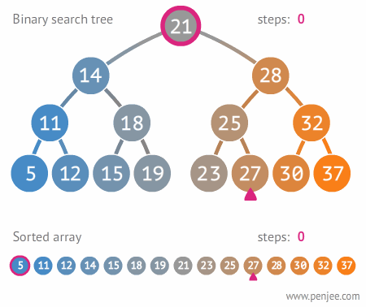

# Binary Search Tree *(BST)*

## Task 1 - BST

## Introduction

Previously you have implemented linked data structures such as singly linked lists and doubly linked lists. These data structures are 'expanding data structures' or 'sequences' which can expand and contract by manipulating nodes. The code for our `node_t` struct and our `linkedlist_t` were structured in the following way:

```c
// An individual node in a linked list
typedef struct node{
	int myData;
	struct node* next;
}node_t;

// A linked list data structure
typedef struct linkedlist{
	struct node* head;
	struct node* tail;
	unsigned int size;
}linkedlist_t;
```

 A linked list is a convenient expanding data structure, where we can append nodes to the head or tail of a list in constant time (O(1)). A general technique to add more power to our linked list structure is to add additional nodes to allow us to traverse the linked data structure forward and backward. When we do this, we create a data structure known as a [doubly linked list](https://en.wikipedia.org/wiki/Doubly_linked_list/). Observe how we can add an additional pointer which allows us to traverse our list in both directions.

A *Doubly Linked List* node took the form of:

```cpp
typedef struct dllnode{
	int count;		// count keeps track of how many items are in the DLL.
	struct node* next;
	struct node* prev;
}dllnode_t;
```

In this assignment we are going to build on these ideas to create what is called a [binary search tree](https://en.wikipedia.org/wiki/Binary_search_tree) or a *BST*. We have seen how the binary search algorithm allows us to 'prune' away half of the search space each iteration in a sorted collection when stored in an array. However, if we are not using an array and instead a 'linked data structure' we would not be able to efficiently perform a binary search. We cannot efficiently search with our list data structures because we have to iterate through every item one at a time--even if we started at the middle. Let's read on further to learn about Binary Search Trees!

# What is a *Binary Search Tree* (BST)

 

A [binary search tree](https://en.wikipedia.org/wiki/Binary_tree) (BST) is a special instance of the 'tree' data structure which has at most two links from it. A binary tree as shown in the picture on the right is typically suited for showing hierarchical relationships between data (i.e. parent-child relationship). It may be helpful to for example think of a family tree, where the parent nodes are all *older* than the child nodes at each level. Capturing this relationship is much more difficult when using a linked list, doubly linked list, stack, queue, etc. (Note that trees in general capture hierarhical relationships very nicely--for example your file system is a 'tree' when you are navigating your files.)

A binary tree is again a linked data structure--so in order to make a binary tree, we need to link together a series of nodes.  A binary tree node differs from a linked-list in that it does not have the notion of a *previous* and a *next* pointer, but instead it has a *leftChild* and a *rightChild* pointer. Here is a sample below: 

```cpp

// Create a node data struct to store data within
// our BST. In our case, we will stores 'integers'
typedef struct bstnode{
    int data;               // data each node holds
    struct node* leftChild; // pointer to left child (if any)
    struct node* rightChild;// pointer to right child (if any)
}bstnode_t;
```

Observe from the struct above (bstnode_t) that we have two pointers from a node to their direct descendent nodes (i.e. the left child and right child node)

For our bst_t data structure, we will structure it similar to the linked-list and doubly-linked list, a binary search tree contains a pointer to its first node. This special node is called the *root* and it points to the beginning (i.e. the top) of the tree. 

```cpp
// Our BST data structure
// Our BST holds a pointer to the root node in our BST.
typedef struct bst{
    unsigned int size;  // Size keeps track of how many items are in the BST.
                        // Size should be incremented when we add.
    bstnode_t* root;	// root points to the root node in our BST.
}bst_t;
```

## BST Operations

For this assignment, you are going to be implementing the following operations to have a working implementation of a BST. So in a sentence: **Your task** is to implement the following functions in [my_bst.c](./my_bst.c).

```c
bst_t* bst_create();
int bst_empty(bst_t* t);
int bst_add(bst_t* t, int item);
void bst_print(bst_t *t, int order);
int bst_sum(bst_t *t);
int bst_find(bst_t * t, int value);
unsigned int bst_size(bst_t* t);
void bst_free(bst_t* t);
```
Summarized below are some examples of operations performed on a bst.

### Some Helpful Illustrations

It can be helpful to take a look at a few animations for how to implement each of the operations.

#### bst_add

 

For the add operation, you will be traversing the tree. As you traverse,  you will compare the current element you are iterating with the element you would like to add. If it is less than or equal to the current element, you will move left. If it is greater, than you will move right. 

There is an edge case that the very first node you add to a tree will become the root.

Here is another sample construction of a bst tree.


 


#### bst_find

 

The above illustration best illustrates the 'find' operation as you traverse the tree from the root of the tree.

Here is another illustration (showing how you would insert a new node--but the same logic applies to 'find')

 

#### bst_sum

For computing the sum, we only need to make sure we visit each node, and visit each node exactly once. Think about what traversal strategies we have learned, and how you may record a sum.

##### Other notes and strategy:

Your implementations should be done recursively. Once you get the hang of just focusing on one of the operations, the rest will come earlier. I might suggest trying to write 'add' first, so you can construct some interesting trees for your 'sum', 'find', and 'print' operations.

## Unit Tests

A unit test is a standalone test that checks for the correctness of a specific use case in your code. In our case, we are testing if we have a working bst implementation. A sample unit tests is given:

```cpp
// Testing allocation
int unitTest1(){
    int result;
    bst_t * testBST = bst_create();
    if (testBST!=NULL){
        result = 1;
    }else{
        result = 0;
    }
    bst_free(testBST);
    return result;    
}
```

You *may* also consider writing some unit tests to test your implementation (In fact, I would strongly encourage you to do so). Note that you can include your unit tests in your submission, and we will have our own test suite. Some example tests we might come up with include:

* Fill a BST with values 1-100 and searching for nodes
* Add 100 nodes and then check that the size is 100
* Add 100 nodes with the value of '2' and check that the sum is 200.
* etc.

## Compiling and running the program

* A make file is provided so you can compile the project by just typing: `make` in the root directory where the [Makefile](./Makefile) is located.
* Alternatively you can compile the source code with: `clang -g main.c my_bst.c -o main` (With debugging symbols)

# Task 2 - Binary Search Tree Complexity Q & A.

Discuss and answer the following questions in [exercises.md](./exercises.md)


# Resources to help

- [Binary Search Tree wiki](https://en.wikipedia.org/wiki/Binary_search_tree (abstract_data_type))
  
# Feedback Loop

(An optional task that will reinforce your learning throughout the semester)

- Investigate/Review more data strutures on this webpage: [Visualgo](https://visualgo.net/en/bst?slide=1)
	- There are visuals for the binary search tree here!
	- Use them as a *rough* outline for the general concept. 
	- Do make sure to follow the specifications in the assignment.
