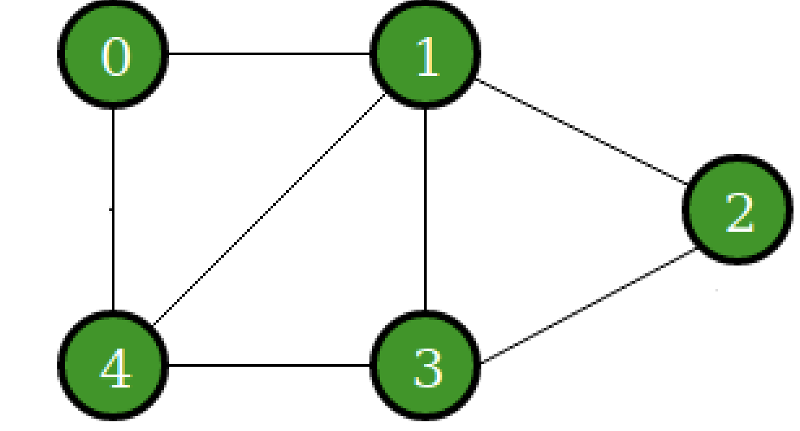
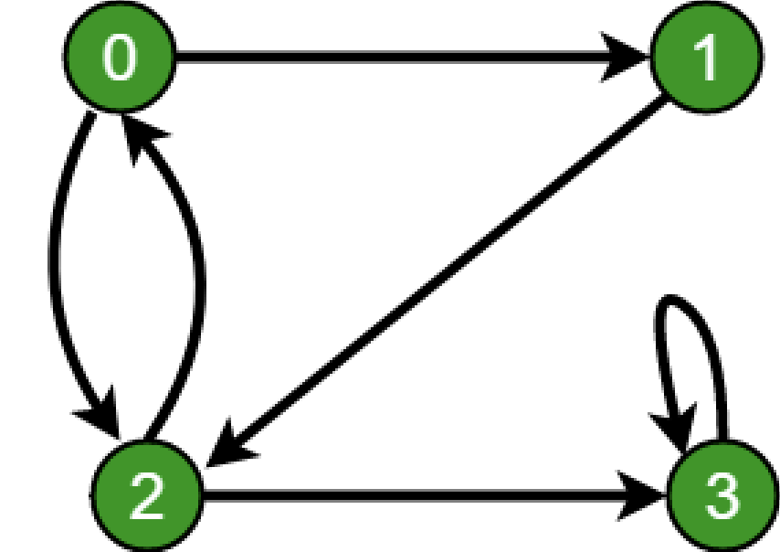

# Directed and Undirected Graphs


In the previous assignment you implemented what is callled a [binary search tree](https://en.wikipedia.org/wiki/Binary_search_tree) 
(BST). In this assignment we are going to implement another data structure, the [graph](https://en.wikipedia.org/wiki/Graph_(abstract_data_type)).

## The Tree.
 

As a reminder we have looked at one type of graph already--a tree. A tree is a special instance of a graph which by definition cannot have cycles. Trees also go by another name--directed acyclic graph(DAG), which implies they are directed graphs. A tree contains nodes (a.k.a *vertices*) which point to its children to show a hierarchical relationship (i.e. children nodes do not point up to a parent or grandparent). So when traversing a tree, we have a root node where we start and we can traverse down each level in the tree to each child node to uncover its data.

<br><br><br><br><br>

## The graph

A graph more generically is a data structure that can model many types of relationships. Graphs can have cycles and can be directed or undirected and have positive or negative weights associated with each edge. The graph shown on the left is undirected where as the graph on the right is directed. 

  

In the graph on the left we can go from node 0 to node 1 or vice verse. However, in the graph on the right we can go from node 0 to node 1 but we cannot go from node 1 to node 0 directly, we have to find another path (i.e. visit node 2 and then visit node 0). 

Just like in a tree, in a graph, the nodes are called vertices and the connections are called edges. 


## How do we represent graphs

There are two ways to represent graphs:

1. An adjacency list (i.e. neighbor's list )
2. An adjencency matrix ( shown in this week's lab (lab5) ).

### A neighbor's list

The idea here is that each node stores a list of its neighbors, rather than having a single right and left child like in a BST.

Let's revist our node class to see how this can be done: 

```c
//This is the node we used for our BST.  
typedef struct node{
	int data;
        struct node* leftChild;
	struct node* rightChild;
}node_t;
```

Our graph node_t differs however, one of its fields will be a list that will contain the nodes we are pointing to (out_neighbors), and the nodes that point to us (in_neighbors).

```c
typedef struct graph_node{
	int data;
	dll_t * out_neighbors;
	dll_t * in_neighbors;
}node_t;
```

So while we previously learned about an adjacency matrix where one could use an array to store the neighbors: ask yourself, why might this be problematic? An answer is that you have to be careful to allocate enough space for all of your neighbors. If you run out of space you may have to perform an expensive copy operation(O(n)), or if you have too much space, you are wasting precious memory.

What we are left to do is our <code> graph_t </code> structure? We only need to store all of our neighbor nodes, and we can store them in a doubly linked list.

```cpp
typedef struct graph_t{
	dll_t* nodes;
}graph_t;
```

### Software reuse

Notice that the neighbors in the graph node (and the nodes in the graph) are stored in a ```dll_t```. Our ```dll_t``` from your previous Assignment stores integers. Therefore we need need to change the data type in the `dll_t` node from ```int``` to ```void*```, since we are storing pointers to graph nodes. Notice how we didn't change the data to ```graph_node_t*``` but rather to ```void*```. This enables us to store any type of pointer in the ```dll_t```, and not just ```graph_node_t*```. This is how C data structures deal with being able to store different data types (i.e. generics). If this wasn't the case we would need a different ```dll_t``` for every type.

```c
//This is the node for our DLL implementation
typedef struct node{
	void* data;		// This is the change
	struct node* next;
	struct node* prev;
}node_t;
```

Now we can reuse all of the Doubly Linked List(DLL) functionallity and the implementation of our graph becomes easier.

For example our `add_node(graph_t * g, int data)` would look something like this:

```c
//This is the node for our DLL implementation
 int add_node(graph_t * g, int data){
 	if ( g == NULL ) return -1;
 	
	//make sure a node with this data is not alredy in the graph.
	//You would need to write this function.
	//You would have to search through the dll of graph nodes and see if a graph node with this data is
	//already in the list.
	if ( find_node(g, data) == 0 ) return -1;
	
	//If it isn't then make a new graph_node_t with this data.
	graph_node_t * newNode = createNewGraphNode(data); // this is a helper function that mallocs a new 
	//graph node and assigns its data field.
	if ( newNode == NULL ) return -1;
	
	push_back(g->nodes, newNode);
	g->numNodes = g->numNodes + 1;
 }
```

Note that `push_back` is defined in our DLL. We can call `push_back` here because `g->nodes` is a DLL. 


## TO DO

The structure of the code has already been provided for you. 

* You need to paste your Doubly Linked List(DLL) code for each function from your previous Assignment into the [my_dll.h](./my_dll.h) header file. Note that the signatures have already been updated for you.  

## Recommendations for this assignment

* As this is a longer assignment than usual please compile very often after small changes. 
* Make sure that every small change that you write works by compiling and **testing** it, before moving on to another change. 
* Writing a lot of code without compiling it or even testing it especially for this assignment is very likly to cause headaches. 

## A hint on writing the traversal algorithms

As you have seen in class, there needs to be away to figure out if a node has already been visited when traversing a graph so we don't end up in an infinite loop. There are two approaches to go about this:

1. Introduce a `int visited` field in our `graph_node_t` struct that is 1 if the node has been visited otherwise 0. If you choose to go this route you would need to reset all *visited* flags in each node to 0 before doing a new traversal.

2. You could either have a ```dll_t``` that stores all the nodes that you've already visited. 

# Unit Tests

A unit test is a standalone test that checks for the correctness of a specific use case in your code. In our case, we are testing if we have a working *graph_t* implementation. 

You should write unit tests to test your implementation.

# Task 2 - Graph Complexity Q & A.

Discuss and answer the following questions in [exercises.md](./exercises.md)

# Resources to help

- Graph Data Type High level description
  - [https://en.wikipedia.org/wiki/Graph_(abstract_data_type)](abstract_data_type)
  
# Feedback Loop

(An optional task that will reinforce your learning throughout the semester)

- Investigate/Review more data strutures on this webpage: https://visualgo.net/en/graphds
  - There are visuals for the graph there!
  - Use them as a *rough* outline for the general concept. Do make sure to follow the specifications above.
