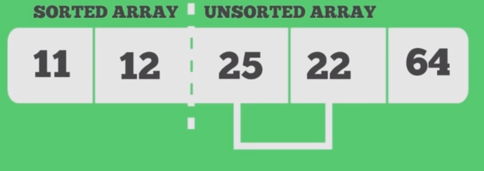

# Selection Sort
> "Computers are really just fancy machines for storing and finding information" - Your instructor


It is amazing how fast computers can search and find information. Think about how long it would take you to look through more than 500,000 books in a library? So what is the big trick computers use for finding the right information so quickly? Simple--we sort all of the data prior to our search, thus allowing us to search for information much more efficiently.

## What did we previously learn about searching? Complexity Matters.

Previously we learned that a binary search is faster than a linear search (it helps us make better guesses when searching for information when the data is sorted). A linear search means looking through each piece of information one at a time, while a binary search can eliminate half of the possibilities each step of the algorithm (as opposed to only removing '1' item from our search space at a time with the linear search). We often compare algorithms based on their *complexity class* to figure out their efficiency.

<table>
  <tbody>
    <tr>
      <th>Algorithm</th>
      <th align="center">Complexity</th>
      <th>n = 100</th>
      <th>n = 100,000</th>
    </tr>
    <tr>
      <td>Linear Search</td>
      <td align="left">O(n)</td>
      <td>100</td>
      <td>100,000</td>
    </tr>
    <tr>
      <td>Binary Search</td>
      <td align="left">Log(n)</td>
      <td>6.64</td>
      <td>16.60</td>
    </tr>
  </tbody>
</table>

From the table, if we are given 'n' number of items to search, then the log(n) will be smaller than O(n). You can also visualize this on a graph. In the chart below, as our input grows(along the x-axis), the lower the height(on the y-axis, typically representing time) we like to have for our algorithms. Log(n) behavior for our search algorithm is clearly lower (thus better) than O(n).


Binary search and linear search are just two of many [search algorithms](https://www.geeksforgeeks.org/searching-algorithms/) that exist for searching for data. There also exist many [sorting algorithms](https://en.wikipedia.org/wiki/Sorting_algorithm) for sorting data prior to searching. We will start with a sorting algorithm that does an *okay* job at sorting, and then figure out how to make it more efficient later! 

# Part 1 - Selection Sort 

For this assignment, you are going to implement in 'C' selection sort. A skeleton file has been provided called [sort.c](./sort.c). You will know your result is correct, if the data you have sorted is done so in [ascending order](https://www.mathsteacher.com.au/year7/ch02_power/06_asc/asc.htm).

## Selection sort at a high level

The selection sort algorithm at a high level, works by repeatedly finding the minimum value in an array and placing it in the correct position. 

* Imagine yourself going through your wallet and selecting the smallest bill, and moving it to the front. Then searching through all of the bills after that first bill and finding the second smallest bill. 
* Another analogy would be if you are sorting cards, and selecting the 'lowest' value card first to put in a pile, then searching again through the remaining (n-1 total cards) in the deck, and selecting the next smallest card.

The expected output of sorting an array **in ascending order** is the following: an array with the values `[50,5,20,10,1]` would be sorted in ascending order to be `[1,5,10,20,50]` (the smallest value preceding a larger value).

## Pseudo-code

The pseudo-code for [selection sort](https://en.wikipedia.org/wiki/Sorting_algorithm#Selection_sort) goes as follows:

```c
1. Iterate through your array and find the smallest element in an array
2. Swap the smallest element with the first element of the array
3. Iterate again through your array, but this time, find the second smallest element and place it in the second position.
   - You know the smallest element is in the first position already, so you are swapping in the second position 
   - As you follow this pattern, you build a 'partially sorted' array for the first N-sorted items, until you reach the end of your array..
```



Take a moment to think about how we would sort in descending order. What would we be searching for in the array? If you said the maximum value, you are correct! Thus, if we want to sort in descending order, then we would select the maximum value through each iteration.

**Note**: Regardless of the data structure (i.e. if we are using an array or a linked list to hold our elements), the algorithm follows the same set of steps. However, for this assignment, an array is slightly easier to work with when swapping elements.

## Designing the algorithm

An algorithm itself does not have to be one single function. Sometimes it is helpful to have some 'helper functions' to make the code easier to understand. For selection sort, I recommend three different functions, and the function stubs have been provided in the [sort.c](./sort.c) code.

1. swap -- Swaps two integers in an array
2. findMinimum -- Finds at which index in an array the minimum value is found (Note: this is the index, not the actual value).
3. sortIntegers -- This is where you will perform the actual selection sort.

## Compiling and running the program.

When you have made an attempt at the sorting algorithm, go ahead and try to run it. Remember to save, compile, and test early and often!

* Compile the source code with: `clang sort.c -o sort`
* Run the source code with: `./sort`

# Part 2 - Selection Sort Complexity Q & A.

Discuss and answer the following questions in [exercises](./exercises.md).

# Deliverable

- Modify the file called [sort.c](./sort.c) and implement a version of selection sort that sorts numbers in ascending order.
- Answer the questions in Part 2 in [exercises](./exercises.md)

# More resources to help

- [Selection sort video](https://www.youtube.com/watch?v=xWBP4lzkoyM)
- [Khan Academy Sorting, pseudocode, analysis, and exercise](https://www.khanacademy.org/computing/computer-science/algorithms/sorting-algorithms/a/sorting)

# (Optional) Going Further Task:

(This is an ungraded task--only work on this if you finish the deliverable). You will have to do a little bit of work to figure out how to open and read from files for this task.

- Implement bubble sort
- Implement selection sort, but this time, use a linked list as the storage data structure, instead of an array.
