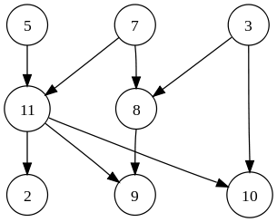

# Lab 11 - Adjacency Matrix and Topological Sort


> "A fundamental graph data structure" - Your instructor

In today's lab we are going to explore the [adjacency matrix](https://en.wikipedia.org/wiki/Adjacency_matrix) data structure and also experiment with [topological sort](https://en.wikipedia.org/wiki/Topological_sorting). [Topological sort](https://en.wikipedia.org/wiki/Topological_sorting) is an example of sorting information in a tree in a linear order. It makes uses of [Depth-First Search](https://en.wikipedia.org/wiki/Depth-first_search) which we have previously implemented!.

# Part 0 - SSH and git pull

1. First open a terminal and ssh into the Khoury servers ``` ssh khoury_user_name_here@login.khoury.neu.edu ```
2. Navigate to your Monorepo directory(Use the `cd` command to change directory, `ls` to see files, and `pwd` to see your path)
3. When you are within your Monorepo, do a ```git pull```. This will add all of the files I have previously pushed into your repositories.

# Part 1 - Adjacency Matrix Data Structure
When working with graphs, the first thing we need is to utilize a data structure that can store our graphs node and edge relationships (Or more formally our graphs vertex and edges given "G(V,E)"). We are going to work with something called an [adjacency matrix](https://en.wikipedia.org/wiki/Adjacency_matrix).

## Structure of adjacency matrix for General Graphs

Provided below is an example adjacency matrix. 

```c
/*  ============= Tutorial on Graph format ============
    You are given a randomly generated graph that looks 
    of the form:

    0 0 1 1 1
    1 0 0 1 1
    0 1 0 1 1
    1 0 0 0 0
    1 0 1 1 0

    You can think of the graph with labels for each of
    the nodes (sometimes called vertices) more clearly below:

               0 1 2 3 4
               ---------  
    node 0:    0 0 1 1 1
    node 1:    1 0 0 1 1
    node 2:    0 1 0 1 1
    node 3:    1 0 0 0 0
    node 4:    1 0 1 1 0

    A '1' represents a connection to a node, and a 0
    means it is not connected.

               0 1 2 3 4
               ---------  
    node 0:    0 0 1 1 1
    node 1:    1 0 0 1 1
    node 2:    0 1 0 1 1
    node 3:    1 0 0 0 0
    node 4:    1 0 1 1 0

    In the above, '0' is connected to 2, 3, and 4.
    That means node 0 has directed-edges out 
    to nodes  2,3,and 4. In other words, 
    the edge-list for node 0 is:
    0->2, 0->3, 0->4
    
    The number of connections a node has out is its 'out-degree'
    The number of connections a node has in are it's 'in-degree'
*/
```

## Multi-dimensional array (2D Arrays)

In order to create an [adjacency matrix](https://en.wikipedia.org/wiki/Adjacency_matrix) we need to allocate a multi-dimensional array in C. We will create an array with 2 dimensions in this lab.

In the [adjacencymatrix.c](./adjacencymatrix.c) file, you will find the following.

```c
#define ROWS 5
#define COLUMNS 5

int g_testgraph[ROWS][COLUMNS];
```

In the above example, we create a multidimensional array of int's named `g_testgraph`. There are 5 rows and 5 columns, thus our array can hold 25 (5 ROWS * 5 COLUMNS) integers.

## Accessing data in the adjacency matrix.

Working with multidimensional arrays can be a little tricky. Remember when we create an array, it is just a contiguous block of memory (regardless if it is 1D, 2D. 3D, etc.).

Often however, it is convenient to think about picking out a row and a column (i.e. visualizing the grid of 5x5 integers). Shown below is our array of 25 integers, which are laid out in memory as follows:

```c
// This indeed looks like a 1-D array, but we want to think about
// accessing the i-th row and j-th column
|0|1|2|3|4|5|6|7|8|9|10|11|12|13|14|15|16|17|18|19|20|21|22|23|24|
```

Again, so even if I create an array `g_testgraph[5][5]`, it will have the memory layout above.

So if I rearrange memory in a 2D grid to more conveinently visualize it, I get the following visualization.

```c
// Ah, this is much better
// Now this is more useful when thinking about a graph
0  1  2  3  4
5  6  7  8  9
10 11 12 13 14
15 16 17 18 19
20 21 22 23 24
```

Hmm, now we want to access the item '1' in my above grid I do so by accessing the 0th row and the 1st column: `g_testgraph[0][1]`
Now if I want to access '16', I do so by accessing the third and the 1st column: `g_testgraph[3][1]`

## C and multi-dimensional arrays in functions

A functionality we will want, will be to pass our graphs around in functions. Now C can be a little 'wonky' when it comes to passing multi-dimensional arrays to functions as parameters. What this means is, we somehow need to specify the size of how big our array is to our function(e.g. like when we created a queue or stack and specified the capacity). Unfortunately, in most C compilers we typically can only pass along a pointer to our array. This means we need to do a little bit of arithmetic to figure out where in memory we are.

The following code is an example of 'offsetting' to the correct position within an array. You will notice, there is some arithmetic in our array to access the appropriate row and column `g[i*ROWS+j]`: 

```c
// This function will print out the adjacency
// matrix for a graph 'g'.
void printGraph(int* g){ 
    int i,j;
    for(i=0; i < ROWS; i++){
        for(j=0; j < COLUMNS; j++){
            printf("%d ",g[i*ROWS+j]);
        }
        printf("\n");
    }
}
```

- In order to access a column, we multiply by `i*ROWS` which is selecting the row 
    - (e.g. multiplying when i=0 puts us in the 0th row).
- Then we move along the column (the `+j` part) when we are in the correct row.

Take a little bit of time to try to understand what is going on here and convince yourself this will print the graph. <!-- **Each partner should verbally** explain to each other how this works to make sure you each understand. -->

## Part 1 - Task

Okay, now that you understand the data structure, you will implement two functions to practice retrieving some graph data:

1. Implement: `nodeInDegree(int* g, int node)`
2. Implement: `nodeOutDegree(int* g, int node)`
3. Implement: `isConnected(int* g, int node1, int node2)`

<!-- **With your partner:** Discuss and answer the following: -->

1. We have focused primarily on *time complexity* in this course, but when choosing data structures, space complexity is often as important of a constraint. Given an adjacency matrix, what is the 'space complexity' in Big-O. That is, given *N* nodes, how much space (i.e. memory) would I need to represent all of the relationships given.
2. Will it ever make sense for ROWS != COLUMNS in an adjacency matrix? That is, if we want to be able to model relationships between every node in a graph, must rows always equal the number of columns in an adjacency matrix?

Your answers here:

1. The space complexity of an adjacency matrix is O(N^2). 
This is because for N nodes, you would need to store a matrix of size N x N to represent all possible relationships between the nodes. Each cell in the matrix represents a possible edge between two nodes, so for N nodes, you would need N^2 cells.

2. In an adjacency matrix, ROWS should always equal COLUMNS. This is because each row and each column represents a node in the graph, and each cell (i, j) represents an edge from node i to node j. If ROWS != COLUMNS, it would mean that some nodes can have edges to more nodes than others, which is not possible in a simple undirected or directed graph. Therefore, to model relationships between every node in a graph, rows must always equal the number of columns in an adjacency matrix.

## Compiling and running the program.

Remember to save, compile, and test early and often!

* Compile the source code with: `clang adjacencymatrix.c -o adjacencymatrix`
* Run the source code with: `./adjacencymatrix`

# Part 2 - Topological Sort

In this next section, you will get to play with a tool called [tsort](https://man7.org/linux/man-pages/man1/tsort.1.html) which can perform a topological sorting of data. Note that you must be ssh'd into the servers to use tsort.


## modify topo.txt

Given the following [Directed Acyclic Graph (DAG)](https://en.wikipedia.org/wiki/Directed_acyclic_graph), modify the file [topo.txt](./topo.txt) to show the relationships in the above graph and output the topologically sorted ordering.



As an example, 3 connected with 8 will be represented as follows in a line on the file.
```
3 8
```

When you have entered the graph, then run tsort.


## Running the program.

```
tsort topo.txt
```

## Part 2 - Task 2

Modify [topo2.txt](./topo2.txt), but this time add labels (i.e. some reasonable ordering of things you do), and again run tsort. Add at least 10 entries:

```
eat sleep
eat exercise
...add 8 more entries...
```

<!--**With your partner:** Discuss and --> Answer the following:

1. Can you run topological sort on a graph that is undirected? 
2. Can you run topological sort on a directed graph that has cycle? 
3. For question number 2, how would you know you have a cycle in a graph? What algorithm or strategy could you use to detect the cycles? **Hint** we have already learned about this traversal.

Your answer:

1. No, you cannot run a topological sort on an undirected graph. Topological sort is used for directed acyclic graphs (DAGs) to linearly order the vertices such that for every directed edge u -> v, vertex u comes before v in the ordering.

2. No, you cannot run a topological sort on a directed graph that has a cycle. This is because topological sort requires the graph to be a Directed Acyclic Graph (DAG). If there is a cycle, the graph is not acyclic and thus a topological sort is not possible.

3. To detect a cycle in a graph, you can use depth-first search (DFS). While doing a DFS, for every visited vertex 'v', if there is an adjacent 'u' such that 'u' is already visited and 'u' is not the parent of 'v', then there is a cycle in the graph. If we don’t find such an adjacent for any vertex, we say that the graph is acyclic.


# Deliverable

- Part 1
    - Implement 3 functions in your [adjacencymatrix.c](./adjacencymatrix.c)
    - Edit your responses in the README.md.
- Part 2
    - Modify [topo.txt](./topo.txt), [topo2.txt](./topo2.txt)
    - Edit your responses in the README.md.

# More resources to help

- [DAG](https://en.wikipedia.org/wiki/Directed_acyclic_graph)
- [Multidimensional Array in C](https://www.learn-c.org/en/Multidimensional_Arrays)
- [Graph Theory: 07 Adjacency Matrix and Incidence Matrix](https://www.youtube.com/watch?v=LUDNz2bIjWI)

# (Optional) Going Further Task:

(This is an ungraded task--only work on this if you finish the deliverable). You will have to do a little bit of work to figure out how to open and read from files for this task.

- Make your adjacency matrix dynamically allocated, and remove the #define for ROWS and COLUMNS
    - Think about how you will need to modify your function parameters appropriately for working with an adjacency martrix of any size.
    - **Note**: Doing this refactoring will remove the warnings that you get when compiling the default code and is the best practice. The #define for the ROWS and COLUMNS is for simplicity in this lab.
- Try the same exercises instead using an adjacency list to represent your graph.
