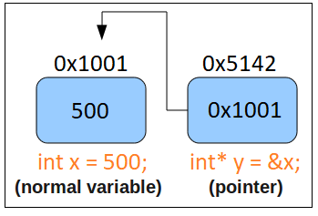

# Lab 2 - Linked List
> "A first non-trivial data structure"

Data structures are a way for us to store information. Most programming languages come with support for an 'array' data structure for instance. As a reminder, an array is a data structure which stores homogenous datatypes in a contiguous piece of memory. That is a fancy way of saying:

```cpp
int array1[100]; // This array holds strictly integers.
unsigned int array2[100]; // This array holds strictly unsigned ints.
float array3[100]; // This array holds strictly floats.
```

Arrays can also be *statically allocated*. That is, at compile-time (before a program is run), we know exactly how much memory is required of the array.

Here are some examples of statically allocated arrays:
```cpp
int numbers[10];	// 'numbers' is large enough to store exactly 10 integers.
char firstName[15];	// 'firstName' stores up to 15 char's
float piDigits[5000];	// 'piDigits' holds 3.1415....well, up to 5000 digits.
```

Again, the *statically allocated* portion means that there is a fixed number of elements in the arrays. This value is decided when we write our source code and compile it at compile-time. From the example above, we may thus only store the first 5000 digits of pi, or first names that are 15 characters or less.

Often however, we do not know how many elements need to be stored, or the number of elements may need to be reduced over time. For this problem, a data structure that can expand and contract can be very useful. Being able to expand means we do not need to know exactly how many elements we need to store, and being able to contract means we can save the finite amount of memory on our computers.

For today's lab, we will be implementing a data structure known as the **singly linked list**. This exercise will give you practice with:

1. struct's
2. pointers

# Part 1 - Understanding a struct - Creating Custom Data Types

## Struct basics

A struct is a user defined data type (i.e. it does not exist natively in C) that stores multiple pieces of data. We call this a composite data type. Here is an example of a struct in C:

```cpp
  // The C language keyword 'struct' is followed by our new data type name.
  // We now have a new datatype called 'Student'
  struct Student{
    int age;      // A field called 'age' that holds integer values is stored.
    int userID;   // An additional field 'userID' also holds integer values.
  };
  
  // Using the struct
  int main(){
    // We create a new struct named 'mike'
    // Note the 'struct' keyword is followed by the data type we defined above.
    struct Student mike;
    // We set the fields for our variable 'mike', which were previously not initialized.
    mike.age = 100;
    mike.userID = 123456789;
  
    return 0;
  }
```

## struct typedef

If you noticed in our example where we created a student, we had to type `struct Student` which can become cumbersome to type. So we can use another C language keyword to save us some typing. Observe the change in line '3' with the word [typedef](https://www.tutorialspoint.com/cprogramming/c_typedef.htm). Next observe line '6' with 'Student_t'. This gives us a new type name that we can use within our main program, instead of constantly typing out `struct Student mike` we instead type `Student_t mike`

```cpp
  // The C language keyword 'struct' is followed by our new data type name.
  // We now have a new datatype called 'Student'
  typedef struct Student{
    int age;      // A field called 'age' that holds integer values is stored.
    int userID;   // An additional field 'userID' also holds integer values.
  }Student_t;
  
  // Using the struct
  int main(){
    // We create a new struct named 'mike'
    // Note the 'struct' keyword is followed by the data type we defined above.
    Student_t mike;
    // We set the fields for our variable 'mike', which were previously not initialized.
    mike.age = 100;
    mike.userID = 123456789;
  
    return 0;
  }
```

(Note: Giving our Student type a suffix of `_t` is a standard practice that indicates this is custom struct)

# Part 2 - Understanding Pointers



A pointer is a variable that points to an address in memory. That is, it stores an 'address' in memory as its value.

Here are some examples in a program you can type out and run.

```cpp
#include <stdio.h>
  
// Using the struct
int main(){
	// A regular variable	
	int x = 10;
	// A pointer that points to 
	// where 'x' is stored in memory.
	// Think of the data type as 'int*' 
	// (i.e. the asterisk or star is stuck to the data type)
	int* pointer_x = &x;
	// So if we print out the value we should get some
	// address in memory.	
	// (Note: You can google what %p is doing)
	// (	  Why do you think we had to cast the value?)
	printf("pointer_x value: %p\n",(void*)pointer_x);

	// Here we 'dereference' pointer_x to extract the value
	// of the 'thing' it points to. That is, what is the value
	// that exists at its address.
	printf("dereferencing pointer_x gives us %d\n",*pointer_x); 

	return 0;
}
```

So if a pointer can point to one value, and then point to another, do you think those values can be chained together? Let's read on to see if we can make a new data structure

# Part 3 - The Linked List - a new data structure!

In our previous examples(Part 1) we created a 'Student'. But often we have many Students in a class. Using what we learned in Part 2 about pointers, we can actually link all of the students together. This involves building a new data structure, the linked list.

The linked list is a data structure that can grow or expand. The way in which it does this is by 'pointing' to other nodes and forming a chain (You can think of this as holding hands with someone next to you, and then them holding hands with someone else next to them, etc.).

Conceptually a linked list is a custom composite data type typically called a 'node' that stores some data, and the location of the next node (A "composite data type" is a fancy way of saying a *struct* which contains many different pieces of data).

(Image from zentut)


From a coding perspective, a node struct may look something like this.

```cpp
typedef struct node{ // Note typedef saves us some typing so we do not have to type 'struct' everytime.
    int myData;
    struct node* next;
} node_t;	// Here is where the 'typedef' name is specified as 'node_t'
```

Everytime we create a node, we point the 'next' pointer to that node. This stores the location of the next node.

(Image from zentut)
(Note the first node is typically called the 'head' and the end is the 'tail')


Here is one example of a singly linked list that exists. 

```cpp
#include <stdio.h>

typedef struct node{
	int myData;
	struct node* next;
}node_t;
  
// Using the struct
int main(){
	
	// (Step 1) ===== Create our Nodes =====
	// Create a first node and assign the field myData to a value
	node_t node1;
	node1.myData = 100;
	// Create a second node and assign the field myData to a value
	node_t node2;
	node2.myData = 200;

	// (Step 2) ===== Linking our Nodes =====
	// Link together the nodes
	// node1 points to the address of node2
	node1.next = &node2;
	// node2 does not have a next node, so set it to 
	// NULL.
	node2.next = NULL;	

	// (Step 3) ===== Do something useful =====
	// ... do some work here

	return 0;
}
```

Note, that we are not doing anything fancy(i.e. using 'malloc' or 'free) in the above example regarding how we create the nodes. Thus these variables are stored on the stack.

## Iterator Pattern

Now what if we want to traverse the linked list?

We can do so by using an 'iterator' pattern. That is, we use a temporary node that points to each node. The 'iterator node' then points the current node_t to node_t.next each iteration until *next* is NULL.

Here is an example you can try to program. This one is also fun to draw out on paper to understand how it works.

```cpp
#include <stdio.h>

typedef struct node{
	int myData;
	struct node* next;
}node_t;
  
// Using the struct
int main(){

	// (Step 1) ===== Create our Nodes =====
	// Create a first node and assign the field myData to a value
	node_t node1;
	node1.myData = 100;
	// Create a second node and assign the field myData to a value
	node_t node2;
	node2.myData = 200;

	// (Step 2) ===== Linking our Nodes =====
	// Link together the nodes
	// node1 points to the address of node2
	node1.next = &node2;
	// node2 does not have a next node, so set it to 
	// NULL.
	node2.next = NULL;	

	// (Step 3) ===== Iterator pattern =====
	// Create an iterator node
	node_t* iterator;
	// The iterator needs to point to the first node (i.e. the head of the list)
	iterator = &node1; // Remember iterator is a pointer, so it points to an address(thus 'address of node1')
	
	// Now we want to look through everything, so we will use a loop.
	// While the iterator is not NULL, continue pointing to new things.
	while(iterator != NULL){
		// Print myData, which is the head in the first iteration.
		printf("%d\n",iterator->myData);
		// Then move our iterator to whatever our 'next' node is in the linked list.
		iterator = iterator->next;
		// If our iterator is NULL, this loop terminates.
	}

	return 0;
}
```


# Part 4 - Our task-- Implement a linked list function with real world data

Now we are ready to put our linked list to work and try ourselves!

## Task 1 - Build a linked list

You will be modifying the **linkedlist.c** file. A crash course for the basic idea of what you are doing is here if you get stuck: https://www.youtube.com/watch?v=SB9si64asSk&index=8&list=PLvv0ScY6vfd8qupx0owF78ZcbvySvbWfx

Your task is to build a linked list with some data. The data you will link together is the number of wins the Red Sox have gotten in recent history. 

### Data

Below is the year and the amount of wins that each year the Red Sox baseball team had. A correct output of the program will print out the following information.

```
2018, 108 wins
2017, 93 wins
2016, 93 wins
2015, 78 wins
2014, 71 wins
```

[Red Sox Data source](http://www.espn.com/mlb/history/teams/_/team/Bos) (Add more data if you like)

Your guidelines for this task are:
1. Create a 'node' struct that can store the red sox data (it can have type 'node_t' for instance).
2. Write a function (create_list) that creates a Linked list that populates a linked list with the win data. 
	1. It should return a pointer which will be the head of the list.
	2. *Hint* This means within your function you must allocate on the heap.
3. Create a second function (print_list) that iterates through the linked list and prints out the data.
	1. The data should be output it in some meaningful way.
	2. Think about what the input parameters should be to the function.
4. Write a third function(free_list) that free's your linked list.
	1. This means you are calling 'free' on each node you have malloc'd. Think carefully about how to do this. How will you know this works?
	2. You can try running with the tool 'valgrind' if you get stuck.

**Hints**
- What does this code do? ``` node_t* new_node = (node_t*)malloc(sizeof(node_t));```
- Would it be useful to make a ```node_t* create_node(int data, node_t* next)``` function?
  - You may use the http://www.zentut.com/c-tutorial/c-linked-list/ resource as a reference. Cite sources in your source file if you use them.

# Deliverable

- Modify the file called **linkedlist.c** demonstrating an example of a linked list following the guidelines in Part 4.

# More resources to help

- Structs: https://www.tutorialspoint.com/cprogramming/c_structures.htm
- Pointers: https://www.tutorialspoint.com/cprogramming/c_pointers.htm
- Linked List: http://www.zentut.com/c-tutorial/c-linked-list/ or https://www.cprogramming.com/tutorial/c/lesson15.html
- Typedef: https://en.wikipedia.org/wiki/Typedef

# (Optional) Going Further Task:

(This is an ungraded task--only work on this if you finish the deliverable). You will have to do a little bit of work to figure out how to open and read from files for this task.

## First task - obtain some data

Provided within the lab is a shell script (**data.sh**) to obtain some real world data. Provided below are some examples for obtaining some data that we can read in using shell scripts. You can choose whichever data you and your partner like. 

Running the script with `sh data.sh` will bring in the data and save it to a text file or a spreadsheet. You could then read this data into a linked list and display it.

```shell
# Column selector for Red Sox data (prints out index and column name):
curl -s http://www.ccs.neu.edu/home/awjacks/cs3650f18/Labs/2/red_sox_history.csv | awk -F ',' '{ if (NR ==1)  for (i=1; i<=NF; i++){ print i, $i } }

# Win column from Red Sox historical data:
curl -s http://www.ccs.neu.edu/home/awjacks/cs3650f18/Labs/2/red_sox_history.csv | awk -F ',' '{ if (NR > 2)  { print $5 } }' > sox_wins.txt

# An alternative win column selector (Now you know about curl and wget)
wget -O - http://www.mshah.io/comp/Fall18/Systems/Lab/2/baseballdata.csv | cut -d ',' -f 5 | tail -n +2 > data.txt

# There are more public domain texts at the Guttenberg project https://www.gutenberg.org/ 
# Below are some other examples.

# US Declaration of Independence broken up at each comma:
curl -s http://www.ccs.neu.edu/home/awjacks/cs3650f18/Labs/2/usdeclar.txt | awk -F ',' '{ if (NR > 6)  for (i=1; i<=NF; i++) { print $i } }' > doi-segment.txt

# US Declaration of Independence word by word:
curl -s http://www.ccs.neu.edu/home/awjacks/cs3650f18/Labs/2/usdeclar.txt | awk '{ if (NR > 6)  for (i=1; i<=NF; i++) { print $i } }' > doi-word.txt

```

Notes:
- Depending on the data you read in, it may be text or integer based--adapt your function signatures as needed.
