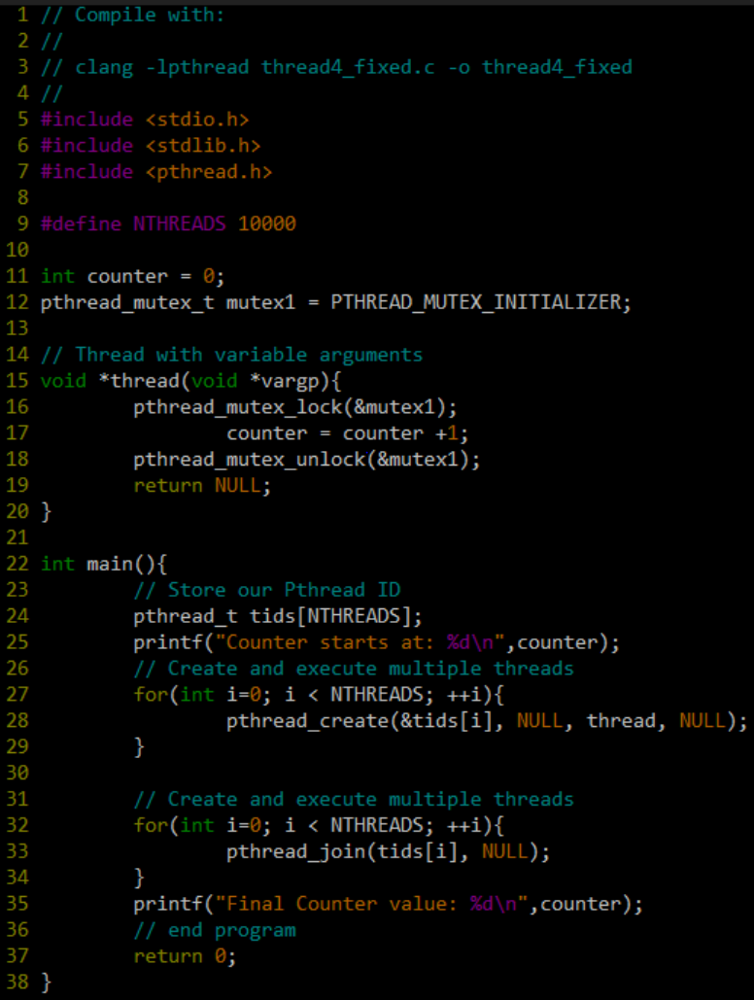

# Lab 6 Multiprocessing - Artists!


Michaelangelo, Picasso, Monet, Kahlo, Cassatt, all legendary artists of their time. For this in-class lab, you are going to be painting a masterpiece, or rather--help a bunch of competitive artists work on a masterpiece together.

The trouble is, these legendary artists do not like other artists to be in their workspace (We will refer to artists as 'processes' and vice versa). The artists all have been contracted to work on the same canvas, and it is our job to make sure they do not wander off and paint on another artists own section when creating the final masterpiece. In order to emulate this, we are going to build a multi-processing system. That is, using multiple processes and threads to build a final masterpiece.

# Logistics

For this lab, you must login into the servers through `your_khoury_name@login.khoury.neu.edu` to complete the assignment. The reason is because the examples I will provide below are compiled strictly for our machines architecture, and this is where your submission will be graded.

## Lab Strategy

Part 1 has many parts. If you get stuck, do not be afraid to read a bit ahead and revisit a previous section. A partial solution is offered at the end of Part 1 to help orient you.

## Part 1 - Processes (work in vfork.c)

Our artists prefer to paint in Unix. Unix faciliates parallel processing natively in our system by maintaining multiple processes that are viewed independently.

### Task 1 - System properties

Let us see how parallel we can get (i.e. how many artists) by analyzing our machines. 

- Run:  `cat /proc/cpuinfo | grep "cpu cores"` 
  - The first part (before the pipe) gives us all of the technical specs for our server machines.
  - We then use grep to pick out the number of cpu cores on each of these machines.
  - (The last time I checked there are 8 cpu cores available on 30+ machines. It may be convenient for us to work in multiples of 8 then, which we can always increase later).
  
<!-- **Discuss with your partner:** (And write 1 sentence about your findings here) 

*Write your response here* 
-->
### Task 2 - fork() parallelism

We have worked with  [fork()](http://man7.org/linux/man-pages/man2/fork.2.html) before, but now we are going to take a look at how it could support parallelism. Let us now think about how we can spawn multiple processes from the same program.

- (Some starter code is below)
- Write a program that spawns 8 child processes using fork() and prints out (from the parent) all of the child process ids(pids).
- For each of the child processes, they should call a function called `paint(int workid)` 
   - The paint function takes in one argument the prints out the painter's number (This should be some other unique identifier passed on from the painter).

```c
#include <stdio.h>
#include <stdlib.h>
#include <sys/types.h>
#include <unistd.h>

// Modify your paint function here
void paint(....){ 
	printf("Artist %d is painting\n",workID);
}

int main(int argc, char** argv){

        int numberOfArtists = ???; // How many child processes do we want?

	pid_t pid;
	// main loop where we fork new threads
        for(int i =0; i < numberOfArtists; i++){
                // (1) Perform a fork
                pid = ???
		
		
                // (2) Make only the child do some work (i.e. paint) and then terminate.
                if(pid== ?? ){
			// TODO: make child paint
			// TODO: Then terminate/exit child
		}
        }

        printf("parent is exiting(last artist out!)\n");

return 0;
}
```

### Task 3 - A subtle danger with fork and memory allocation


Something that can be tricky with launching multiple processes, is understanding that we get an exact copy of the process (code, heap, stack, etc.) 

Let us modify our Task 2:
- I want you to *malloc* an integer array with 8000 integers at the top of *main* function (i.e. before we make any call to fork()).
	- `int* integers = malloc(sizeof(int)*8000);`
- Remember to free the memory at the end of our *main* function, just before we `return 0`.
- Run the program to see that it runs properly.
- Second, run the program again in valgrind: `valgrind ./whatever_your_program_name_is`
  - Valgrind is a helpful tool that will check for memory errors (not free'ing memory after allocating).
  - Is there any problem?
  - Assuming you made the modifications specified, there should be some memory leaks!
  	- Where are we forgetting to reclaim our memory?
	- If your compiler is smart enough not to allocate--is this still potentially wasteful?

<!--
**Discuss with your partner:** (And write 1 sentence about where you think we are forgetting to reclaim memory)

*Write your response here*
-->

### Task 4 - Synchronization with fork()

Have you been noticing that anything weird happens if you run your program enough times? It is possible that not all of your proceses are running, and they may not be running quite in order?

Let us fix that--I have two possible solutions to offer.

- The first is that we need to make use of the `waitpid` command. This will wait our parent on a pid. 
  - But which pid is it? One way to keep track would be to have an array in the parent that keeps track of all of the id's and waits on those pids.
- The second is a little trick you can put in your parent. `while((wpid = wait(&status)) > 0);` wpid is a pid_t and status is an int.   
  - What this does is essentially the same as above, making sure every single child processe terminates before resuming execution in the parent.
  
  Here's the snippet:
```c 
	// Your main loop above here

        pid_t wpid;
        int status = 0;
        while ((wpid = wait(&status)) > 0);
	
	// the rest of your code down here
	printf("parent is exiting(last artist out!)\n");
```  

### Task 5 -- remember--fork() does not share memory, but vfork does!

Now we have practiced forking a process, which is one way to achieve some sort of parallelism. However, it becomes quite difficult to really do work on *shared tasks*. Remember, our artists have been contracted to work on the same canvas. In all of our previous examples, they simply called the paint function(which prints a message) and then terminated.

Let us now have our artists work on one giant masterpiece (as originally intended). We will introduce a global array that is shared amongst all of the forked processes (this is similar to a thread).

- Create global 2D array called colors `char colors[64][64*3].` 
  - I have choosen 64 by 64x3 for the dimensions.
  - The first dimension of the array you can think of as the 'row' an artist is painting on.
  - The second dimension is the column, and a value of 0 to 255 is stored to represent the Red, Green, and Blue (RGB) components of the paint color.
- Next, read the man page for vfork(`man vfork`)

<!--
**Discuss with your partner:** (And write 1 sentence about the difference between fork and vfork)

*Write your response here*
-->

Scroll down a bit to see the answers after reading the man page.

```
VFORK(2)                                        Linux Programmer's Manual                                        VFORK(2)

NAME
       vfork - create a child process and block parent

SYNOPSIS
       #include <sys/types.h>
       #include <unistd.h>

DESCRIPTION
   Standard description
       (From  POSIX.1)  The vfork() function has the same effect as fork(2), except that the behavior is undefined if the
       process created by vfork() either modifies any data other than a variable of type pid_t used to store  the  return
       value  from  vfork(), or returns from the function in which vfork() was called, or calls any other function before
       successfully calling _exit(2) or one of the exec(3) family of functions.

   Linux description
       vfork(), just like fork(2), creates a child process of the calling process.  For  details  and  return  value  and
       errors, see fork(2).

       vfork()  is a special case of clone(2).  It is used to create new processes without copying the page tables of the
       parent process.  It may be useful in performance-sensitive applications where a child is created which then  imme‐
       diately issues an execve(2).

       vfork()  differs from fork(2) in that the calling thread is suspended until the child terminates (either normally,
       by calling _exit(2), or abnormally, after delivery of a fatal signal), or it makes a  call  to  execve(2).   Until
       that  point, the child shares all memory with its parent, including the stack.  The child must not return from the
       current function or call exit(3), but may call _exit(2).

       As with fork(2), the child process created  by  vfork()  inherits  copies  of  various  of  the  caller's  process
       attributes  (e.g., file descriptors, signal dispositions, and current working directory); the vfork() call differs
       only in the treatment of the virtual address space, as described above.

       Signals sent to the parent arrive after the child releases the parent's memory (i.e., after the  child  terminates
       or calls execve(2)).
```       

- Firstly, the entire address space is shared! (i.e. all mememory is shared, including the stack, and we can access the *colors* array from every vfork'ed process)
  - (We can also now get rid of any additional frees we had in our child process since memory is completely shared)
- Secondly, your child processes should not terminate using return 0; that will throw an error message. exit(0) however is fine.
- We tend to think of vfork() as a 'lightweight process'. Because there is no copying of data from one process to another, vfork is fast! (You can imagine us consuming quite a bit of memory by copying colors over and over again)
- Finally, we do not need to 'wait' By default the parent will execute after the child from vfork has terminated.
	- But answer this now, do we get any parallelism? We get the benefit of shared memory, but are we now back to sequential access? The only advantage here may be that we can easily separate out tasks.
- Note: vfork is not quite a pthread as we have discussed in class, but close!
	- vfork shares the stack, which is not true of threads which have their own stack (slightly safer!)

### Task 6 - Outputting Images

- Update your program with [vfork](https://www.mkssoftware.com/docs/man3/vfork.3.asp) instead of fork.
	- The signature for this function is as follows: `pid_t vfork(void);`
- Have vfork launch 64 processes 
  - (Note that you could potentially launch more for a bigger color array--but your machine may have a [soft limit](https://www.ibm.com/support/knowledgecenter/en/SSCRJU_4.0.1/com.ibm.streams.install.doc/doc/ibminfospherestreams-install-operating-system-settings.html) of 100 or so processes per user).
  - Run `ulimit -u` to see the limit of processes you have. Mine is 175 for the Khoury machines (yours may be greater or less).
- Within the paint function, have each process work on one row of our color array. 
  - That is, your artist should write one value between the range of 0-255 to each of the 64x3 values in the color array for its particular row (remember, artists do not share rows).
- At the end of your program, write out a file called 'vfork.ppm' that contains the contents of your masterpiece(fprintf will be useful for writing out intgers to a file, and fputs for any strings). A 
  - As a reminder, you can write to a file using the following tutorial: https://www.tutorialspoint.com/cprogramming/c_file_io.htm.
  - The format you are writing to is the PPM format here: http://netpbm.sourceforge.net/doc/ppm.html 
    - A sample for writing out a .ppm image is shown below.
    - (There should be a magic number, dimensions, and  maximum range)
    
```c
// Write out the PPM file
	// If you are looking at this solution, it could
	// be better laid out in a 'save function'
	FILE *fp;
	fp = fopen("vfork.ppm","w+");
	fputs("P3\n",fp);
	fputs("64 64\n",fp);
	fputs("255\n",fp);
	for(int i =0; i < 64;i++){
		for(int j =0; j < 64*3; j++){
			fprintf(fp,"%d",colors[i][j]);
			fputs(" ",fp);		
		}
		fputs("\n",fp);
	}
	fclose(fp);
```

### A note on PPM and images


The image format you are writing is called a PPM (You likely have used or saved images formatted as .jpg, .bmp, .png, or .gif). Images are made up of pixels, which are located with an x,y coordinate. That is, a 64x128 image, is 64 pixels wide, and 128 pixels high. Within each pixel (say pixel (2,100)) are three values, that specify the red, green, and blue components for that individual pixel. The higher the value from a range of 0-255, the more that color is expressed.

The image you are saving in this lab, will thus look something like this.

```
P3
# vfork.ppm (Note this is just a comment)
64 64
255
 0  0  0    0  0  0    0  0  0   125 0  125 .... 60 more triples.
 0  0  0    0 225 7    0  0  0    0  0  0   .... 60 more triples.
 0  0  0    0  0  0    0 15  7    0  0  0   .... 60 more triples.
15  0 15    0  0  0    0  0  0    0  0  0   .... 60 more triples.
```

### How do I view the PPM image?

**See appendix on the end for more sources**

From the ssh servers, we only have a terminal window and no Graphical User Interface(GUI) to view our images. Here are a few options.

1. Use this web interface and drag in your PPM: http://paulcuth.me.uk/netpbm-viewer/
2. Download your respository locally after you commit any changes. Then view your .ppm in an image editor like GIMP(https://www.gimp.org).
3. Depending on your terminal and ssh client, you can actually view images. Your client will need X11 support(https://unix.stackexchange.com/questions/276168/what-is-x11-exactly), which is the protocol for viewing imagse across ssh. 
	- Note when you ssh, you will perform `ssh -Y your_khoury_name@login.khoury.neu.edu`

### (Optional) Task 7

Okay, you have done the work, now times for some foundational reading.

- First up, the man pages. `man shm_overview` (~2 minute read)
- Next up is reading on how to see processes running `man ps`

#### (Optional) Navigating Manual pages

- For fun, you can search all of the man pages. Type `man -K shared` and see what comes up.
  - 'q' quits the man page, Use Ctrl+D to skip pages, Ctrl-C to quit, and /'whatever' to search within man pages. There will likely be many pages!

## Part 1 -- partial solution

Wow, that was a lot of information. Read this section as a last resort! Revisit the above sections first before looking here.

This solution gives most of the ideas of what is achieved from above, minus the image output of a .ppm file which you can implement from the above code sample.

```c
#include <stdio.h>
#include <stdlib.h>
#include <sys/types.h>
#include <unistd.h>

// Global array
// This is our 'canvas' we are painting on.
// It is 64 rows by 64 columns (each pixel stores 3 color components, R,G,B)
int colors[64][64*3];

// Paint function called from each child
void paint(int workID){
        printf("Artist %d is painting\n",workID);

	// workID corresponds to the 'artist'
	// Each artist owns one row to paint on.
	// An artist paints along each pixel 1 at a time, painting an
	// R,G,B value (that is why it is 64*3)
        for(int i =0; i < 64*3; i++){
                colors[workID][i] = workID; // Try doing something more interesting with the colors!
        }
}

int main(int argc, char** argv){

        // Represents how many child processes we want.
	// In this case--64.
        int numberOfArtists = 64;
        // Store the process id.
        pid_t pid;

        for(int i =0; i < numberOfArtists; i++){
                pid = vfork();
                // Work that each child does
                if(pid==0){
                        paint(i);
                        exit(0);
                }
                // Question, why do I log which thread executed here?
                // Log some information in a parent.
                printf("Child created: %d\n",pid);
        }

        // Parent
        printf("Masterpiece(vfork.ppm) is being assembled\n");

        // Write out the PPM file
	// You have to do this!
	// TODO: (See task 6)

        return 0;
}
```


## Part 2 - Threads (work in threads.c)

Okay, so we have refreshed ourselves on how processes work and extended our knowledge to using vfork and shared memory. Now we are going to use [posix threads](https://computing.llnl.gov/tutorials/pthreads/) which are yet another technique for multiprocessing.

Previously when we looked at using multiple processes with our artists problem, we were able to get away with what is known as [data parallelism](https://en.wikipedia.org/wiki/Data_parallelism) because each process worked on a specific row in the final image. We will repeat the same task with threads, and so long as they work in mutually exclusive sections of the canvas, a similar solution will work!

### Task 1 - Artists
#### Prompt/Specification

Once again, Michaelangelo, Rapheal, Donatello, and Leonardo are amongst 64 great artists who have been comissioned to paint on a shared 64x64 canvas that starts out black(RGB of (0,0,0) on each pixel).

- This time, launch 64 threads (Do not use vfork--use [pthread_create](http://man7.org/linux/man-pages/man3/pthread_create.3.html)).
	- Do not forget about [pthreads_join](http://man7.org/linux/man-pages/man3/pthread_join.3.html) as well.
	- An example image is provided below of threading to remind you of the threading interface.
	- (And also how to include a library *-lpthread* when compiling. Ah, I knew the linker would be useful!)
- Have each artists `paint` in parallel to modify the `colors` array.
	- Output a final image called 'threads.ppm' (it may again look similar, but this time you should be practicing using threads).

<!--
**Discuss with your partner:** (And write 1 sentence if you think you need to use locks anywhere in this solution)

*Write your response here*
-->

(Here is a quick reminder below of using threads for your reference.)

  

## Lab Deliverable

1. Generate an image using vfork that uses multiple processes.
	- You should save the image as vfork.ppm and upload it to github.
2. Generate an image using pthreads using multiple threads. 
	- You should save the image as threads.ppm and upload it to the github.
	- If you want to see more of the pthreads interface type: `man -k pthread`
<!--
3. Answer the discussion questions and edit this README.md	
-->
	
This lab will be related to your homework. Make sure to do it first :)

## More Resources to Help

* pthreads tutorial: https://computing.llnl.gov/tutorials/pthreads/
* fork vs vfork: https://techdifferences.com/difference-between-fork-and-vfork.html
* Some discussion on fork and vfork trade-offs: https://gist.github.com/nicowilliams/a8a07b0fc75df05f684c23c18d7db234

## Going Further

- A nice book on multiprocessing https://www.amazon.com/Art-Multiprocessor-Programming-Revised-Reprint/dp/0123973376
- A few commands on multiprocessing summarized that you should be familiar with: http://faculty.salina.k-state.edu/tim/CMST302/study_guide/topic8/multi.html

# Appendix - How to View Images Remotely (i.e. while ssh'd in)

## SSH and images

Typically when we ssh, we do so from a terminal window. Since we are working with images, we will want some sort of graphical output if you are not working locally from your machine (e.g. on an Ubuntu virtual box instance). There is a program called 'display' that you can run in order to view images.

Unfortunately, if we run `display image_name.ppm` when ssh'd into login.khoury.neu.edu we get an error.
```
-bash-4.2$ display image.ppm
display: unable to open X server `' @ error/display.c/DisplayImageCommand/431.
```

If we look at the man page for display, we get some more information about how display works, and that it needs an *X server*.
```
display(1)                         General Commands Manual                        display(1)

NAME
       display - displays an image or image sequence on any X server.
```

### XServer

The [X Windowing System](https://en.wikipedia.org/wiki/X_Window_System) is Unix's way to draw graphical elements to our screen. When we ssh into a terminal, the information we are passing back and forth between our client terminal(on our machine) and the server(a Khoury machine) is purely text. We want to open up our ssh connection, so we can also pass graphical information back and forth.

- In order to do this, when you ssh type: `ssh -Y username@login.khoury.neu.edu`
	- The -Y option enables trusted X11 forwarding.

### Mac Users

You may download [xquartz](https://www.xquartz.org) which has an X11 server running. When you perform `ssh -Y username@login.khoury.neu.edu`, the 'display canvas.ppm' will magically work!  (It's not really magic, because "There is no magic in Systems".)

### Windows Users

- You can download this shell: https://mobaxterm.mobatek.net/

### Linux/Ubuntu Users

- Unix users should be in luck, an X11 window is running. Just ssh with `ssh -Y username@login.khoury.neu.edu`

### Other

If none of those options work, then you may resort to these options below.

- Use this web interface and drag in your PPM: http://paulcuth.me.uk/netpbm-viewer/
- Download your repository locally after you commit any changes. Then view your .ppm in an image editor like GIMP(https://www.gimp.org).
