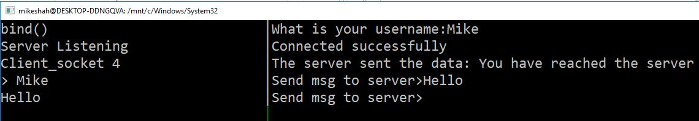

# Lab 5 Networking

The Internet (with a capital "I") is full of many processes running. We have previously learned in lecture how we connect to different ports in a router, and the router properly routes packets of information across the internet. The other tool we have learned about, is a [socket](http://man7.org/linux/man-pages/man2/socket.2.html). Sockets allow for an end-to-end connection between two processes. This communication between sockets may take place amongst two processes in Unix for example, though more commonly, we connect two sockets over the internet domain. Thus sockets are a fundamental primitive for connecting a server and client process together.

In today's lab, we are going bo build a simple server that accepts one connection from a client when it is running.

# Logistics

For this lab, you must login into the servers through `your_khoury_name@login.khoury.neu.edu` to complete the assignment. The reason is because the examples I will provide below are compiled strictly for our machines architecture, and this is where your submission will be graded.

# Strategy

For this lab, when you ssh in, it is helpful to use a tool like tmux to run the tcpserver in one window, and then run the tcpclient in another window. A screenshot is shown below.



# Part 1 - TCP Server and TCP Client

## Task 1 - Foundations


The first task, is to understand the client-server model in regards to sockets.

The following flow chart (on the right) shows a nice breakdown of what the client and server do.

In short, a server:
1. Creates a socket
2. Binds a socket
3. Listens for connections to the socket
4. Accepts connections

The client:
1. Creates a socket
2. Connects to some other connection (e.g. a server)

Once a successful connection is made, a client and server can read and write messages to each other.

## Task 2 - Manual Pages

First we need to understand our tools available to us.

Skim the man pages for the following(It will be helpful to refer to them as you go through the exercise):

- [man socket](http://man7.org/linux/man-pages/man2/socket.2.html)
- [man connect](http://man7.org/linux/man-pages/man2/connect.2.html)
- [man listen](http://man7.org/linux/man-pages/man2/listen.2.html)
- [man send](http://man7.org/linux/man-pages/man2/send.2.html)
- [man recv](http://man7.org/linux/man-pages/man2/recv.2.html)
- [man 2 bind](http://man7.org/linux/man-pages/man2/bind.2.html) 
	- (Note: *man 2* opens up the manual pages for the version of 'bind' related to system calls. Sometimes there are multiple entries in manual pages for similarly named commands.

```
MANUAL SECTIONS
    The standard sections of the manual include:

    1      User Commands
    2      System Calls
    3      C Library Functions
    4      Devices and Special Files
    5      File Formats and Conventions
    6      Games et. al.
    7      Miscellanea
    8      System Administration tools and Daemons
```


## Task 3 - Building a tcp server (tcpserver.c)

Let us begin by building a tcp server that runs and accepts connections from clients. You will be modifying the file `tcpserver.c` for this part of the lab.

**Goal**: Build a tcp server that accepts a connection from a client.

### Step 1 - Getting libraries setup
First, let us setup the header files which provide us our necessary networking libraries for working with sockets (this is for both our client and server).

```c
// Our standard libraries
#include <stdio.h>
#include <stdlib.h>
#include <string.h>

// Some types and unix operations
#include <sys/types.h>
#include <unistd.h>

// A sockets library and internet protocol library
#include <sys/socket.h>
#include <netinet/in.h>
```

### Step 2 - Creating a server socket

Now create a main() function, and begin creating your server.

Now lets create a server socket:
```c
	// Create the server socket
	int server_socket;
	//			domain, type 	    ,protocol
	// domain = AF_INET(IPv4) or AF_INET6			
	server_socket = socket(AF_INET, SOCK_STREAM, 0);
```

socket takes three parameters.

- Domain: Which domain are we communicating over. 
	- Examples are AF_INET for IPv4 or AF_INET6 for IPv6
- Type: The type specifies how the communication will occur. 
	- SOCK_STREAM means there is a two-way connection using TCP. Remember, TCP communication is reliable and in-order.
- Protocol: This specifies which protocol we are using.
	- Typically we set this to 0, which means only 1 protocol exists for communciation (you could have more in theory).

### Step 3 - Setting up the address to communicate from

After we have created a socket, we need to figure out what addresse we are going to serve communications from.
To do this, we create a `sockaddr_in` struct([man 7 ip](http://man7.org/linux/man-pages/man7/ip.7.html)) which holds information about our server address format.

We need to make sure we do three th ings when setting up our server socket:

1. Match the protocol(`IF_INET`)
2. Set a port number that is not used (typically not a well known port)
3. Then an internet address(Let's use `INADDR_ANY` which represents localhost for our machine). 

```c
	// define the server address format
	struct sockaddr_in server_address;

	server_address.sin_family = AF_INET;
	server_address.sin_port = htons(9002); // 9002 is choosen arbitrarily. Try other ports if this does not work
	server_address.sin_addr.s_addr = htons(INADDR_ANY);
```

**Note:** The address format we use for our server, must also be matched with our clients.

### Step 4 - Binding our server

Now that we have an address where we would like our server to exist we want to `bind` it to a socket. That is, our socket is created, but it does not yet know where to send and receive information from.

```
	bind(server_socket, (struct sockaddr*) &server_address, sizeof(server_address));
	printf("Server bind()\n");
```

### Step 5 - Listening (i.e. waiting for client connections to our server)

So our server is now connected to a specific port within the localhost. Since this is a server, if we review our architecture, we want clients to be able to connect. The tool for doing this is the `listen` function.

listen() takes two parameters:
1. The first parameter is a socket descriptor.
2. The second parameter is for how many client connections can be queued to join. 
	- In this case, I have set 27, such that 27 clients could be queued up in the server to connect.

```c
	listen(server_socket, 27);
```

### Step 6 - accepting connections to our server.

For the final step, our server should accept connections from clients. That is, a client will attempt to `connect` to a server, and if this happens we will send the client a message (and then our server will shutdown).

```c
	// Integer to hold a potential client socket
	int client_socket;
	client_socket = accept(server_socket, NULL, NULL);

	// send a message from the server
	char server_message[256] = "You have reached the server";

	send(client_socket, server_message, sizeof(server_message), 0);

	// Close the socket
	close(server_socket);
```


Make sure all of this code is within a main function, and then give it a test!

If your server is running, it will wait patiently forever (i.e. not do anything useful).

## Task 4 - Building a tcp client (tcpclient.c)

Now that our server has been built, let us build a client in a separate c file called tcpclient.c.

### Step 1 - Getting libraries setup

Again, let us setup the header files which provide us our necessary networking libraries for working with sockets (this is for both our client and server).

```c
#include <stdio.h>
#include <stdlib.h>
#include <string.h>

#include <sys/types.h>
#include <sys/socket.h>

#include <unistd.h>
#include <netinet/in.h>
```

### Step 2 - Creating a client socket

Now, in your main() function, start creating your client.

Just like with our server, we are going to create a socket. The semantics will look very similar.

```c
	// Create a socket
	int client_socket;
	// Note that the protocol matches our server here
	// Also note I am doing some error checking for my socket.
	// You may consider updating your server code to do the same.
	if((client_socket = socket(AF_INET, SOCK_STREAM, 0)) < 0){
		printf("\n Socket creation error \n");
	}
```

### Step 3 - Setting up the address to connect to

Now we need to specify where we want to connect to. Take a moment to guess what the address format should be.

```c
	// Our client will connect to a server with the following address and port.
	struct sockaddr_in server_address;
	server_address.sin_family = AF_INET; // 32-bit IPV4 address
	server_address.sin_port = htons(9002); // convert to the appropriate port number using htons
	server_address.sin_addr.s_addr = htons(INADDR_ANY); // Our ip address, which is localhost using INADDR_ANY
```

### Step 4 - connect()

Now that we have created a socket and have specified where we want to connect to, let us try to connect.

```c
	// Attempt to connect
	// Returns an integer as an error code (zero means everything worked)
	int connection_status;

	// Report back to user if our connection was successful
	if( (connection_status = connect(client_socket, (struct sockaddr*)&server_address, sizeof(server_address))) <0 ){
		printf("%d Connection unsuccessful\n", connection_status);
		close(client_socket);
		exit(0);	
	}else{
		printf("Connected successfully\n");
	}
```

If the connection is received successfully, then we should see a print out of the status. Otherwise, our program will terminate.

### Step 5 - Receive server message.

Finally, when our client connects, the client can receive a message from the server and then exit.

```c
// Receive data from the server
	char server_response[256];
	recv(client_socket, &server_response, sizeof(server_response), 0);
	
	// Print out the server's response
	printf("The server sent the data: %s\n",server_response);

	// Then close the socket
	close(client_socket);
```


## Task 5 - Running the Server and client -- and Thinking ahead

### Step 1

I recommend opening up two windows in [tmux](https://hackernoon.com/a-gentle-introduction-to-tmux-8d784c404340).

* Run in one window: `./tcpserver`
* Run in a second window: `./tcpclient`

When Your client connects to your server, your client should get a message from the server, and then both applications will shutdown.

### Step 2

For your homework, you will be working on adding some more customizations. Here are some things to discuss and think about with your partner.

1. How could a client have a 'username'
2. How could a client send more than one message after connecting?
3. How could you have multiple connections accepted from your server?

## Lab Deliverable

- Implement `tcpclient.c`
- Implement `tcpserver.c`

### More Resources to Help

Here are some more resources on socket programming

- [Commented tutorial on sockets](http://www.cs.rpi.edu/~moorthy/Courses/os98/Pgms/socket.html)

## Going Further

For this final task, you may want to update your client-server chat to handle multiple connections.

- The following is a tutorial if you have time at the end or outside of class.
[GeeksforGeeks tutorial](http://www.geeksforgeeks.org/socket-programming-in-cc-handling-multiple-clients-on-server-without-multi-threading/)


