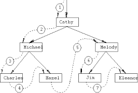

# Lab 10 - Recursive Strategies


> "Recursion recursion recursion recursion recursion recur..." - Your instructor

The cartoon above illustrates an idea of '[recursing](https://en.wikipedia.org/wiki/Recursion_%28computer_science%29)' However, we want to be careful not to recurse 'infinitely' (i.e. have an infinite loop in a program that never terminates). 

1. For part 1, you will implement a factorial function both iteratively and recursively. 
2. For part 2, you will implement a Depth-First Tree Traversal recursively.

Remembering the *general* structure of a recursive program can be helpful:

```c
(1) Base case (or some other way to terminate)

(2) Computation

(3) Recursive Call
```

More generally however, recursive functions should always make the problem you are trying to solve smaller to ensure termination. For example, if you are searching through a 'list' (an example of a problem that is not a math computation), you should only be searching a smaller subset of the list after each recursive call.

# Part 0 - SSH and git pull

1. First open a terminal and ssh into the Khoury servers ``` ssh khoury_user_name_here@login.khoury.neu.edu ```
2. Navigate to your Monorepo directory(Use the `cd` command to change directory, `ls` to see files, and `pwd` to see your path)
3. When you are within your Monorepo, do a ```git pull```. This will add all of the files I have previously pushed into your repositories.

If for some reason you are having troubles, you can always create a new copy of your monorepo by running `git clone https://github.com/COURSENAME/monorepo-yourUserNameHere` in a separate directory.

# Part 1- Recursion in C

* Your task is to implement in the file [factorial.c](./factorial.c) both an iterative and recursive solution to compute the factorial of a number.

For solving this problem, I suggest working on just one part at a time, and testing frequently to make sure your code is working.

As a reminder, a factorial is computed as follows:

```
0! = 1
1! = 1
2! = 2*1
3! = 3*2*1
4! = 4*3*2*1
...
7! = 7*6*5*4*3*2*1
... etc.
```

Note: how the numbers descend, and how that may be a hint for structuring your recursive solution.

## Data sizes and types

Once you have solved the above, answer and modify your programs for the following.

1. If you want to compute a bigger factorial, you will need a larger data type. What is a bigger [data type](https://www.geeksforgeeks.org/data-types-in-c/) you can use to compute larger factorials? Change the 'return type' and input parameters to the factorial to something other than 'int' (and also change the format specifier in printf to something other than %d for the largest C data type you can find).

 *put in a brief answer here to the experiment from question 1 for what data type you changed your facotorial to use*

2. Try <!-- with your partner --> computing factorials larger than say 15. At what input value for the factorial functions does your computer start to 'crash' or really slow down when you try to compute a factorial? Experiment and report your results.

 *put in a brief answer here to the experiment from question 2*

## Compiling and running the program.

Remember to save, compile, and test early and often!

* Compile the source code with: `clang factorial.c -o factorial`
* Run the source code with: `./factorial`

# Part 2 - Depth-First Tree Traversal


For part 2, you will implement a [depth-first traversal](https://en.wikipedia.org/wiki/Depth-first_search) of a 'tree' data structure in [dfs.c](./dfs.c), printing out each node that you traverse. This will help get you get started for understanding how to navigate trees (and graphs).

You are given a `TreeNode_t` data structure that has two pointers that 'chain together' other nodes.

```c
typedef struct TreeNode{
     struct TreeNode* left;
     struct TreeNode* right;
     char data;
}TreeNode_t;
```

By linking TreeNode_t* nodes left and right, you can form a 'binary tree' structure (i.e. you can think of it like a 'family tree' with at most two siblings).

**Your goal** will be to print out the nodes that have been generated for you, and implement the function `void dfs(TreeNode_t* start)`.

### Other notes

* A depth-first traversal is related to the idea of searching in a depth-first search (DFS) pattern if the algorithm terminates after finding an element (when searching).

## Strategy

<!--**With your partner:**--> First draw the tree that has been hard-coded on a piece of paper or in an online notepad. This will help give you a visualization of the tree so you know what is being printed. Then, talk through a strategy for traversing the tree and printing out each node that is traversed.

The traversal of the tree will follow some pattern like this (notice how the arrows trace around the tree going to the next node):



A successful output of the above tree would be:

```
Cathy
Michael
Charles
Hazel
Melody
Jim
Eleanor
(Program ends here)
```

## Compiling and running the program.

Remember to save, compile, and test early and often!

* Compile the source code with: `clang dfs.c -o dfs`
* Run the source code with: `./dfs`

# Deliverable

- Part 1 
  - (0.5 pts) Have a working iterative and recursive solution for computing correct factorials in the [factorial.c](./factorial).
  - (0.5 pts) Answer the questions in the readme regarding factorial.
- Part 2 
  - (1 pt) Have a working traversal of a depth-first traversal that works recursively in [dfs.c](./dfs). 
     - Note: You should print out the nodes in the order you traverse them.

# More resources to help

- [Factorial](https://en.wikipedia.org/wiki/Factorial)
- [data types in C](https://www.geeksforgeeks.org/data-types-in-c/)

# (Optional) Going Further Task:

(This is an ungraded task--only work on this if you finish the deliverable). You will have to do a little bit of work to figure out how to open and read from files for this task.

- Try to implement the DFS with your 'stack' data structure from your own implementation.
